# AlmaLinux 8.10 (Cerulean Leopard) — Operating System Installation Guide

> **Platform:** VMware Workstation 16.0.0 | **Purpose:** Preparation for Oracle Database 19c Installation

| | |
|---|---|
| **Document** | Installation Guide |
| **OS Version** | AlmaLinux 8.10 (Cerulean Leopard) |
| **Platform** | VMware Workstation 16.0.0 |
| **Purpose** | Preparation for Oracle Database 19c Installation |
| **Kernel** | Linux 4.18.0-553.el8_10.x86_64 |
| **Architecture** | x86-64 |

---

## Table of Contents

1. [Overview](#1-overview)
2. [Prerequisites](#2-prerequisites)
   - [2.1 Virtual Machine Specifications](#21-virtual-machine-specifications)
   - [2.2 Software Requirements](#22-software-requirements)
   - [2.3 Downloading AlmaLinux 8.10 ISO](#23-downloading-almalinux-810-iso)
   - [2.4 Target Network Configuration](#24-target-network-configuration)
3. [Part 1 — Boot from Installation Media](#part-1--boot-from-installation-media)
4. [Part 2 — Installation Configuration](#part-2--installation-configuration)
   - [Step 1: Language Selection](#step-1-language-selection)
   - [Step 2: Installation Summary Overview](#step-2-installation-summary-overview)
   - [Step 3: Time & Date](#step-3-time--date)
   - [Step 4: Root Password](#step-4-root-password)
   - [Step 5: User Account Creation](#step-5-user-account-creation)
   - [Step 6: KDUMP Configuration](#step-6-kdump-configuration)
   - [Step 7: Network & Hostname](#step-7-network--hostname)
   - [Step 8: Security Policy](#step-8-security-policy)
   - [Step 9: Software Selection](#step-9-software-selection)
   - [Step 10: Installation Destination (Disk Partitioning)](#step-10-installation-destination-disk-partitioning)
   - [Step 11: Final Installation Summary & Begin Installation](#step-11-final-installation-summary--begin-installation)
5. [Part 3 — Installation Process](#part-3--installation-process)
6. [Part 4 — Initial Setup After Reboot](#part-4--initial-setup-after-reboot)
   - [Step 12: GRUB Boot Menu](#step-12-grub-boot-menu)
   - [Step 13: License Agreement](#step-13-license-agreement)
7. [Part 5 — First Desktop Login](#part-5--first-desktop-login)
8. [Part 6 — GNOME Initial Setup Wizard](#part-6--gnome-initial-setup-wizard)
9. [Part 7 — Post-Installation CLI Configuration](#part-7--post-installation-cli-configuration)
10. [Summary of Key Configurations](#summary-of-key-configurations)
11. [Next Steps](#next-steps)
12. [References](#references)
    - [AlmaLinux Official Documentation](#1-almalinux-official-documentation)
    - [Oracle Database 19c — Related Documentation](#2-oracle-database-19c--related-documentation)
    - [Supporting Tools](#3-supporting-tools)
    - [GPG Key & Security Verification](#4-gpg-key--security-verification-for-almalinux)

---

## 1. Overview

This guide provides detailed, step-by-step instructions for installing **AlmaLinux 8.10 (Cerulean Leopard)** on a **VMware Workstation 16.0.0** virtual machine. The installation is specifically configured to serve as the operating system layer for **Oracle Database 19c**, with settings tuned for compatibility and performance.

**AlmaLinux 8.10** is a community-driven, enterprise-grade Linux distribution that is binary-compatible with Red Hat Enterprise Linux (RHEL) 8.10. It provides a stable, production-ready environment supported by the AlmaLinux OS Foundation.

---

## 2. Prerequisites

### 2.1 Virtual Machine Specifications

| Component | Specification |
|-----------|---------------|
| **Platform** | VMware Workstation 16.0.0 |
| **RAM** | 6 GB (minimum recommended for Oracle Database 19c) |
| **Disk** | 300 GB (VMware Virtual NVMe Disk) |
| **Network Adapter** | VMware VMXNET3 Ethernet Controller |
| **Architecture** | x86-64 |
| **Virtualization** | VMware (detected by `hostnamectl`) |

### 2.2 Software Requirements

- VMware Workstation 16.0.0 or later installed on the host machine
- AlmaLinux 8.10 ISO installation image — see [Section 2.3](#23-downloading-almalinux-810-iso) for download details
- PuTTY or any SSH client for remote management after installation

---

### 2.3 Downloading AlmaLinux 8.10 ISO

Before starting the installation, download the AlmaLinux 8.10 ISO image from the official source.

#### Official Download Page

| Resource | URL |
|----------|-----|
| **Main Download Page** | https://almalinux.org/get-almalinux/ |
| **Mirror List** | https://mirrors.almalinux.org/ |
| **Direct Repository (x86_64)** | https://repo.almalinux.org/almalinux/8.10/isos/x86_64/ |

#### Available ISO Types for x86_64

| ISO Type | Approx. Size | Description | Recommended For |
|----------|-------------|-------------|-----------------|
| **DVD ISO** | ~10 GB | Full offline install — all packages included | ✅ **This guide** — no internet needed during install |
| **Boot ISO** | ~700 MB | Minimal boot only — downloads packages from internet | Online/network install |
| **Minimal ISO** | ~2 GB | Offline minimal install (no GUI packages) | Headless/server installs |
| **Live GNOME ISO** | ~2 GB | Bootable live desktop — try before installing | Desktop evaluation |
| **Live KDE ISO** | ~2 GB | Bootable live KDE Plasma desktop | Desktop evaluation |

> **For this guide, download `AlmaLinux-8.10-x86_64-dvd.iso` (DVD ISO)** — it contains all required package groups for a complete offline Server with GUI installation.

#### ISO Filename Reference

```
AlmaLinux-8.10-x86_64-dvd.iso          ← Full offline install (recommended)
AlmaLinux-8.10-x86_64-boot.iso         ← Network boot only
AlmaLinux-8.10-x86_64-minimal.iso      ← Minimal offline install
```

#### Recommended Mirror Sites (Indonesia / Asia-Pacific)

| Mirror | Provider | URL |
|--------|----------|-----|
| **Indonesia (KPNET)** | PT. Komunikasi Pratama Nusantara | https://mirror.kpnet.id/almalinux/8.10/isos/x86_64/ |
| **Indonesia (Biznet)** | Biznet Networks | https://mirror.biznetgio.com/almalinux/8.10/isos/x86_64/ |
| **Singapore (DigitalOcean)** | DigitalOcean | https://mirrors.digitalocean.com/almalinux/8.10/isos/x86_64/ |
| **Japan (JAIST)** | Japan Advanced Institute of Science and Technology | https://ftp.jaist.ac.jp/pub/Linux/AlmaLinux/8.10/isos/x86_64/ |
| **Australia (AARNet)** | AARNet | https://mirror.aarnet.edu.au/pub/almalinux/8.10/isos/x86_64/ |

> For a complete and up-to-date mirror list near your location, visit: https://mirrors.almalinux.org/

#### Verifying ISO Integrity (Checksum)

After downloading, verify the ISO checksum to confirm the file is not corrupted or tampered:

```bash
# The checksum file is available in the same directory as the ISO:
# AlmaLinux-8.10-x86_64-dvd.iso.sha256sum

# On Linux / macOS
sha256sum -c AlmaLinux-8.10-x86_64-dvd.iso.sha256sum

# On Windows (PowerShell)
Get-FileHash AlmaLinux-8.10-x86_64-dvd.iso -Algorithm SHA256
# Compare the hash output against the value inside the .sha256sum file
```

> **Security Note:** Always verify the checksum before attaching the ISO to the VM to ensure the image is authentic and complete.

---

### 2.4 Target Network Configuration

| Parameter | Value |
|-----------|-------|
| **IP Address** | 192.168.159.134 / 24 |
| **Default Gateway** | 192.168.159.2 |
| **DNS Server** | 192.168.159.2 |
| **Network Interface** | ens160 |
| **FQDN (Hostname)** | al8dbora.company.com |
| **Short Hostname** | al8dbora |
| **IP Assignment** | Dynamic (DHCP) — local VMware NAT network |

> **Note:** A dynamic IP is used because this VM runs on a local PC under VMware NAT. For a static IP in a production environment, configure the interface manually after installation or during the network setup step.

---

## Part 1 — Boot from Installation Media

Power on the virtual machine and boot from the attached AlmaLinux 8.10 ISO image. The GRUB boot menu will appear after a few seconds.

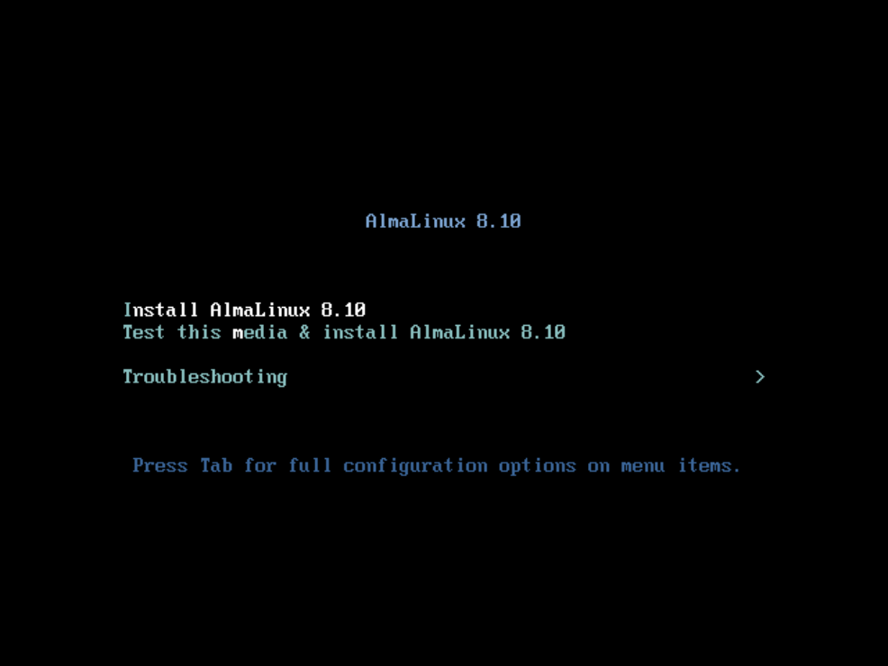

**Available options:**

| Option | Description |
|--------|-------------|
| **Install AlmaLinux 8.10** | Proceed directly to the installation |
| Test this media & install AlmaLinux 8.10 | Verify ISO integrity before installing (slower) |
| Troubleshooting | Access rescue/recovery mode |

Select **"Install AlmaLinux 8.10"** using the arrow keys and press **Enter**.

---

## Part 2 — Installation Configuration

### Step 1: Language Selection

The graphical installer (Anaconda) will load and display the language selection screen.

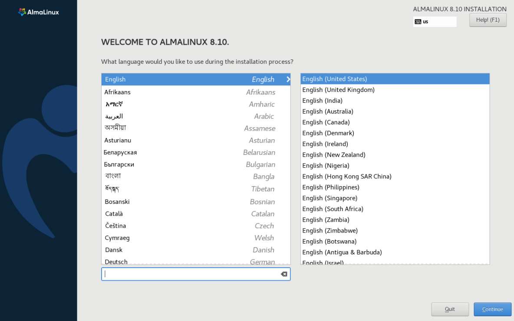

- From the **left panel**, select **"English"**
- From the **right panel**, select **"English (United States)"**
- Click **"Continue"**

> Using English as the installation language is recommended for server environments, as most documentation, log messages, and error outputs are in English.

---

### Step 2: Installation Summary Overview

After language selection, the **Installation Summary** screen appears. This is the central configuration hub — all settings must be configured here before installation begins.

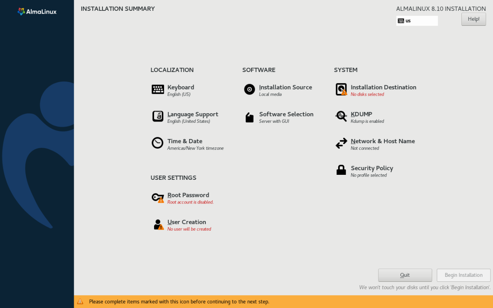

The screen is divided into four sections:

| Section | Configuration Items |
|---------|---------------------|
| **LOCALIZATION** | Keyboard, Language Support, Time & Date |
| **SOFTWARE** | Installation Source, Software Selection |
| **SYSTEM** | Installation Destination, KDUMP, Network & Host Name, Security Policy |
| **USER SETTINGS** | Root Password, User Creation |

> **Important:** Items marked with an **orange warning icon** are mandatory and must be configured before clicking "Begin Installation". At minimum: **Root Password**, **User Creation**, and **Installation Destination** must be set.

Work through each configuration item as described in the following steps.

---

### Step 3: Time & Date

Click **"Time & Date"** under the LOCALIZATION section.

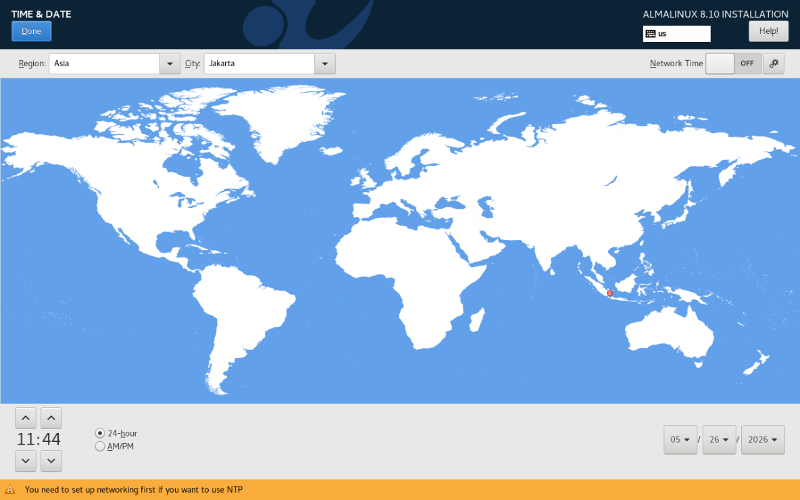

| Setting | Value |
|---------|-------|
| **Region** | Asia |
| **City** | Jakarta |
| **Timezone** | WIB — Western Indonesia Time (UTC+7) |
| **Network Time (NTP)** | OFF during installation (no active connection yet) |

- Click on the map near **Jakarta, Indonesia** or use the Region/City dropdowns
- Click **"Done"** to save

> **Note on NTP:** Network Time Protocol (NTP) will be available after the network interface is fully active. The system clock will sync automatically after first boot if NTP is configured.

---

### Step 4: Root Password

Click **"Root Password"** under the USER SETTINGS section.

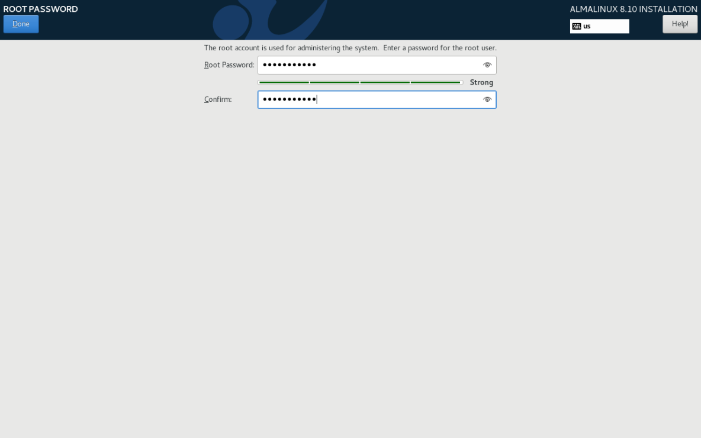

- Enter a strong password in the **"Root Password"** field
- Re-enter the same password in the **"Confirm"** field
- The strength indicator will show **"Strong"** for a secure password
- Click **"Done"** to save

> **Security Recommendation:** Use a password with at least 12 characters combining uppercase letters, lowercase letters, numbers, and special characters (e.g., `!`, `@`, `#`). The `root` account has unrestricted administrative access to the entire system.

---

### Step 5: User Account Creation

Click **"User Creation"** under the USER SETTINGS section.

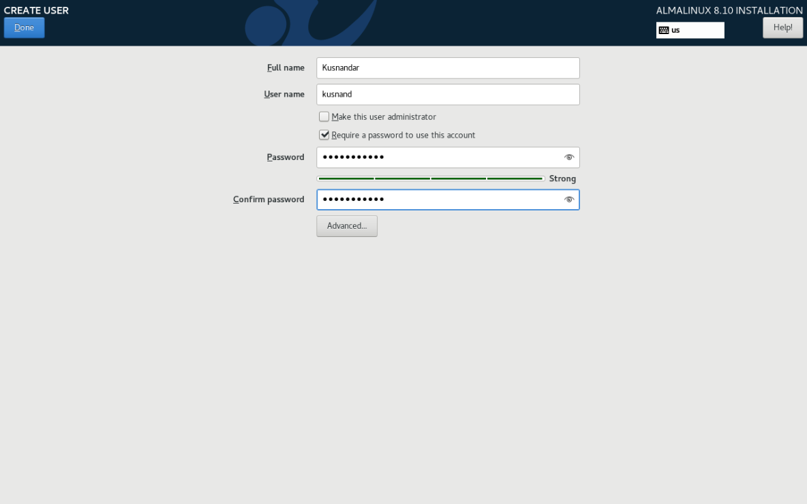

| Field | Value |
|-------|-------|
| **Full name** | Kusnandar |
| **User name** | kusnand |
| **Make this user administrator** | Unchecked |
| **Require a password to use this account** | Checked |

- Set a strong password and confirm it
- Click **"Done"** to save

> **Best Practice:** Always create at least one non-root user. The `root` account should be used only when administrative privilege is explicitly required. Regular operations (including Oracle DB management) use dedicated service accounts.

---

### Step 6: KDUMP Configuration

Click **"KDUMP"** under the SYSTEM section.

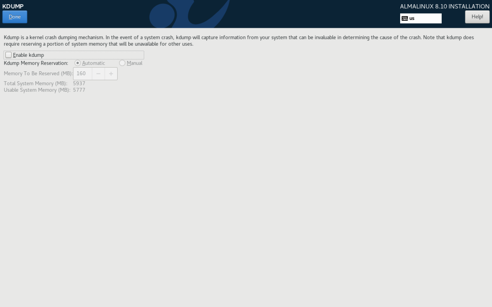

- **Uncheck** the **"Enable kdump"** checkbox to disable it
- Click **"Done"** to save

**System Memory Information:**

| Parameter | Value |
|-----------|-------|
| **Total System Memory** | 5937 MB (~6 GB) |
| **KDUMP Memory Reservation** | 160 MB (freed when disabled) |
| **Usable System Memory** | 5777 MB |

> **Why disable KDUMP?**
> KDUMP is a kernel crash dump mechanism that permanently reserves a portion of RAM at boot. Disabling it:
> - Frees **160 MB** of reserved memory back to the OS
> - Avoids potential conflicts during Oracle Database 19c installation
> - Prevents the Oracle installer from flagging memory as insufficient
>
> KDUMP can be re-enabled after Oracle Database is successfully installed if kernel crash analysis capability is required for production.

---

### Step 7: Network & Hostname

Click **"Network & Host Name"** under the SYSTEM section.

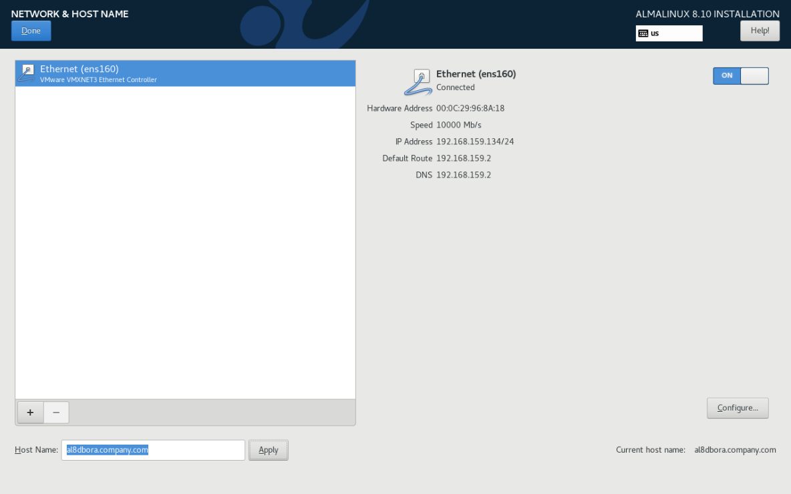

**Configuration steps:**

1. Select the **ens160** interface in the left panel (VMware VMXNET3 Ethernet Controller)
2. Toggle the switch to **"ON"** to enable the interface — it will obtain an IP via DHCP
3. In the **"Host Name"** field at the bottom, enter: `al8dbora.company.com`
4. Click **"Apply"** to set the hostname
5. Click **"Done"** to save

**Resulting network details (after DHCP assignment):**

| Parameter | Value |
|-----------|-------|
| **Interface** | ens160 |
| **Status** | Connected |
| **Hardware Address (MAC)** | 00:0C:29:96:8A:18 |
| **Link Speed** | 10000 Mb/s |
| **IP Address** | 192.168.159.134 / 24 |
| **Default Route (Gateway)** | 192.168.159.2 |
| **DNS** | 192.168.159.2 |

> **Static IP Configuration:** For a production server with a fixed IP, click **"Configure..."** before enabling the interface. Navigate to the **IPv4 Settings** tab, change the method to **Manual**, and add the desired IP address, netmask, gateway, and DNS values.

---

### Step 8: Security Policy

Click **"Security Policy"** under the SYSTEM section.

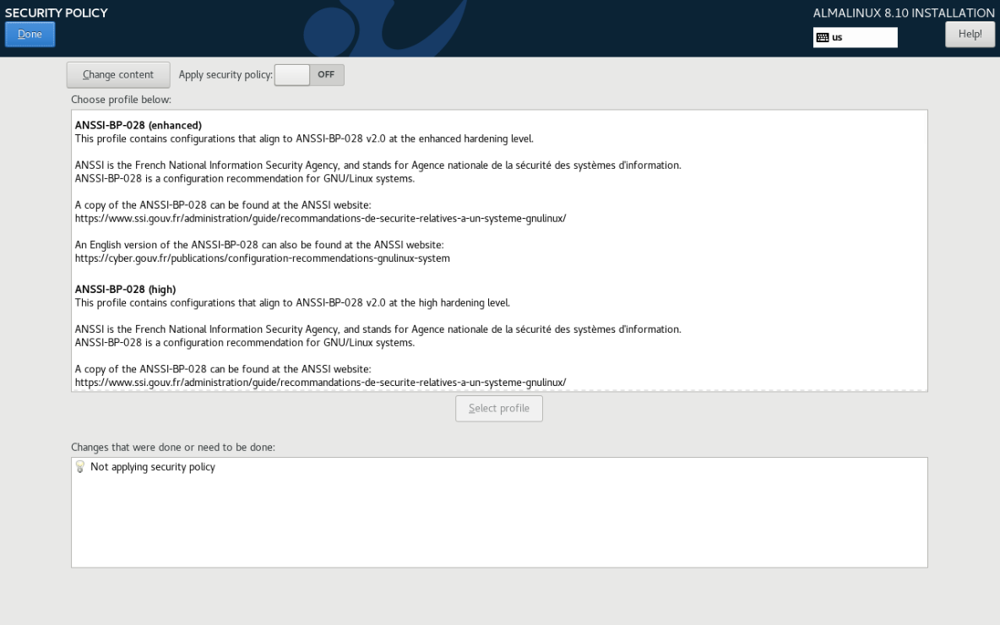

- Set **"Apply security policy"** toggle to **"OFF"**
- The status will show **"Not applying security policy"**
- Click **"Done"** to save

> **Why disable Security Policy?**
> Available security profiles (e.g., ANSSI-BP-028 enhanced/high) apply mandatory OS hardening such as strict file permissions, restricted system calls, and tightened network rules. These restrictions are incompatible with the Oracle Database 19c installation requirements, which need:
> - Specific kernel parameters to be set freely
> - Access to `/tmp` and `/dev/shm` without restriction
> - Installation scripts with elevated privileges
>
> It is recommended to assess and re-apply an appropriate security profile **after** Oracle Database is installed and tested.

---

### Step 9: Software Selection

Click **"Software Selection"** under the SOFTWARE section.

#### Base Environment

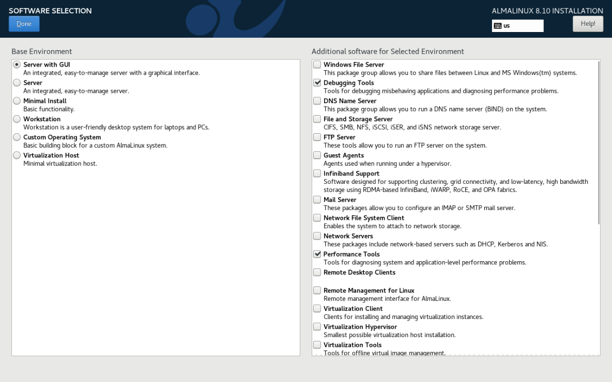

Select **"Server with GUI"** as the Base Environment.

| Base Environment Option | Description |
|-------------------------|-------------|
| **Server with GUI** *(selected)* | Full server with GNOME desktop — enables Oracle graphical installer |
| Server | Integrated, easy-to-manage server without desktop |
| Minimal Install | Minimal packages only — requires silent Oracle installation |
| Workstation | User-friendly desktop for laptops/PCs |
| Custom Operating System | Fully custom package selection |
| Virtualization Host | Minimal virtualization host |

> **Why Server with GUI?** Oracle Database 19c's Oracle Universal Installer (OUI) is a graphical application. Selecting "Server with GUI" provides the GNOME desktop environment required to run OUI interactively. If you prefer a silent (non-GUI) installation, "Minimal Install" is sufficient.

#### Additional Software Groups

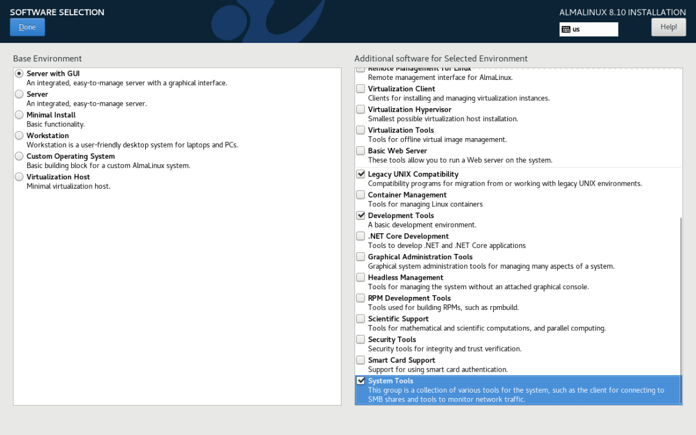

Check the following additional package groups:

| Package Group | Why It Is Needed |
|---------------|-----------------|
| **Debugging Tools** | Tools for diagnosing misbehaving applications and performance problems |
| **Performance Tools** | System and application-level performance diagnostics |
| **Legacy UNIX Compatibility** | Compatibility programs for UNIX migration environments — required by some Oracle scripts |
| **Development Tools** | GCC compiler, `make`, development headers — required by Oracle installer for linking |
| **System Tools** | System utilities including SMB client and network monitoring tools |

Click **"Done"** to save.

---

### Step 10: Installation Destination (Disk Partitioning)

Click **"Installation Destination"** under the SYSTEM section. Select the target virtual disk and choose **"Custom"** storage configuration.

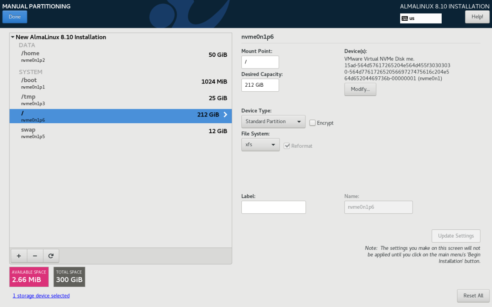

#### Partition Layout

| Mount Point | Size | Device | File System | Purpose |
|-------------|------|--------|-------------|---------|
| `/boot` | 1024 MiB | nvme0n1p1 | xfs | Boot files and kernel images |
| `/home` | 50 GiB | nvme0n1p2 | xfs | User home directories |
| `/tmp` | 25 GiB | nvme0n1p3 | xfs | Temporary files (Oracle installer uses heavily) |
| `swap` | 12 GiB | nvme0n1p5 | swap | Virtual memory (2× physical RAM) |
| `/` | 212 GiB | nvme0n1p6 | xfs | Root filesystem — Oracle software installed here |
| **Total** | **~300 GiB** | | | |

#### Partition Sizing Rationale

| Partition | Reason for Size |
|-----------|----------------|
| `/boot` (1 GiB) | Sufficient for multiple kernel versions and initramfs images |
| `/home` (50 GiB) | Space for user files and Oracle user home (`/home/oracle`) |
| `/tmp` (25 GiB) | Oracle installer extracts large staging files to `/tmp` — at least 10 GB required |
| `swap` (12 GiB) | Oracle recommends 1×–2× physical RAM; with 6 GB RAM, 12 GB swap is used |
| `/` (212 GiB) | Contains Oracle Base (`/u01/app/oracle`) and Oracle Home — large installation footprint |

> **File System Choice (XFS):** XFS is the default and recommended filesystem for RHEL/AlmaLinux 8.x. It provides high performance for large files, supports online resizing, and is well-suited for database workloads.

Click **"Done"** when partitioning is complete.

---

#### Summary of Changes Confirmation

A dialog box will appear listing all disk operations to be performed before changes are written.

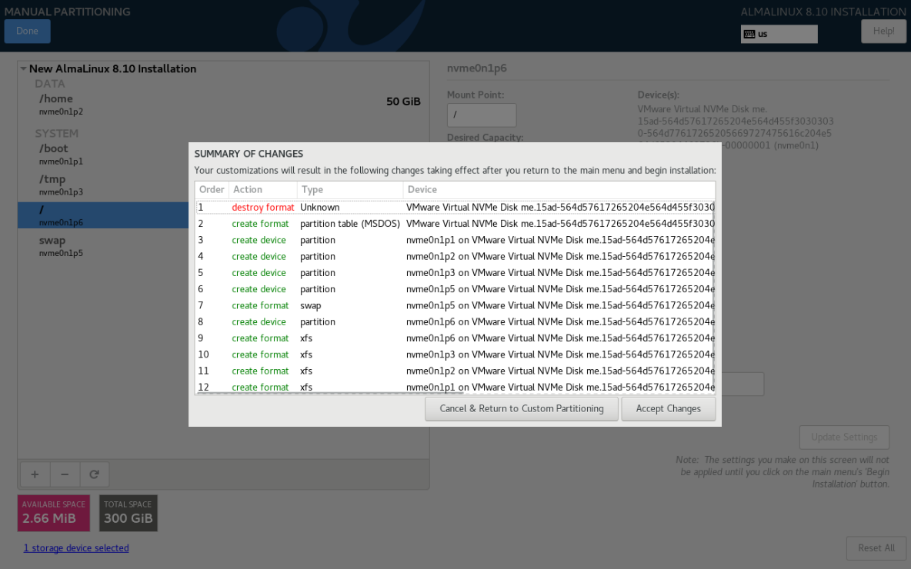

The operations include:
- `destroy format` — removes any existing partition table on the disk
- `create format` — creates a new MBR/GPT partition table (MSDOS format)
- `create device` — creates each physical partition
- `create format` — formats each partition with the specified filesystem (xfs or swap)

Review the list carefully, then click **"Accept Changes"** to confirm.

---

### Step 11: Final Installation Summary & Begin Installation

After all settings have been configured, the Installation Summary will show all items without warning icons.

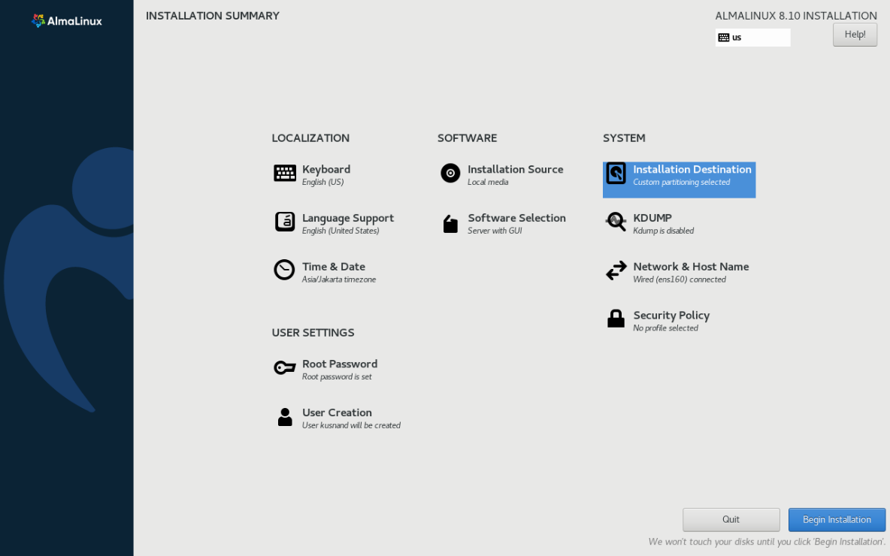

**Pre-installation checklist:**

| Configuration Item | Status | Value |
|--------------------|--------|-------|
| Time & Date | ✅ Configured | Asia/Jakarta timezone |
| Software Selection | ✅ Configured | Server with GUI |
| Installation Destination | ✅ Configured | Custom partitioning selected |
| KDUMP | ✅ Configured | Kdump is disabled |
| Network & Host Name | ✅ Configured | Wired (ens160) connected |
| Security Policy | ✅ Configured | No profile selected (OFF) |
| Root Password | ✅ Configured | Root password is set |
| User Creation | ✅ Configured | User `kusnand` will be created |

All items confirmed. Click **"Begin Installation"** to start the installation process.

---

## Part 3 — Installation Process

The installation will begin automatically. The progress screen shows real-time status.

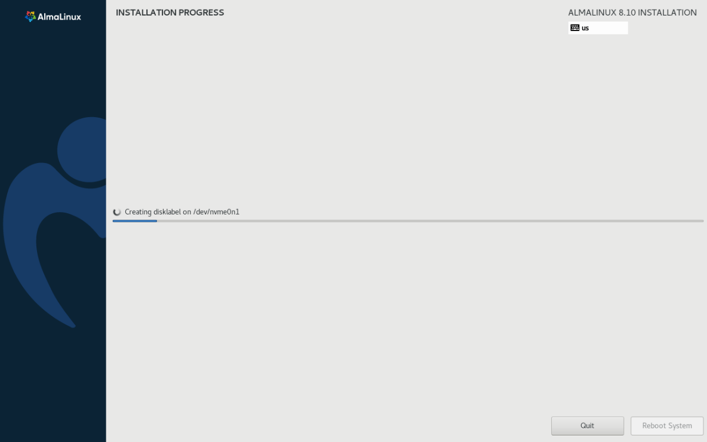

The installer performs the following operations sequentially:

1. Creates a disk label on `/dev/nvme0n1`
2. Creates and formats all partitions (xfs, swap)
3. Installs the base OS packages
4. Installs selected software groups (Server with GUI, Development Tools, etc.)
5. Configures the bootloader (GRUB2) on `/boot`
6. Runs post-installation scripts and SELinux labeling
7. Finalizes system configuration

> **Duration:** The installation typically takes **15–30 minutes** depending on VM performance and disk I/O speed.

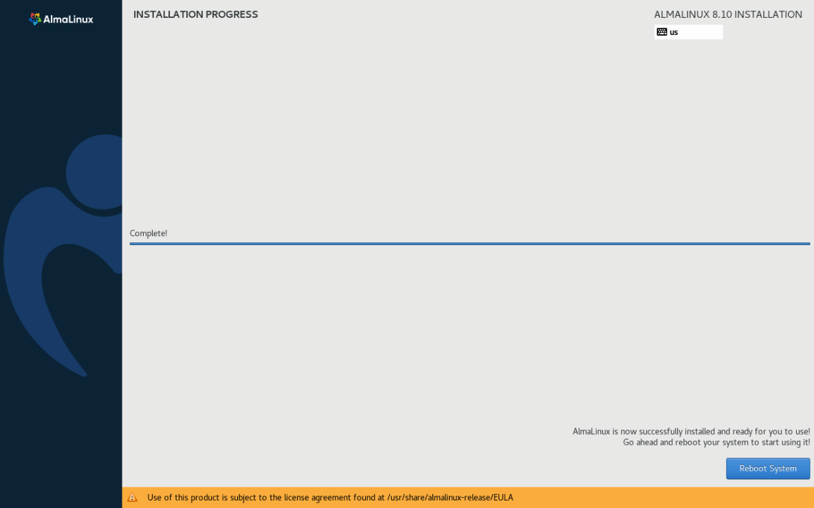

When installation finishes:
- The progress bar shows **"Complete!"**
- Message: *"AlmaLinux is now successfully installed and ready for you to use! Go ahead and reboot your system to start using it!"*
- A note at the bottom references the EULA at `/usr/share/almalinux-release/EULA`

Click **"Reboot System"** to restart the VM.

> **Important:** Remove the ISO image from the VM's CD/DVD drive before or after rebooting to prevent booting back into the installer.

---

## Part 4 — Initial Setup After Reboot

### Step 12: GRUB Boot Menu

After reboot, the **GRUB2** bootloader menu appears. Two entries are available:

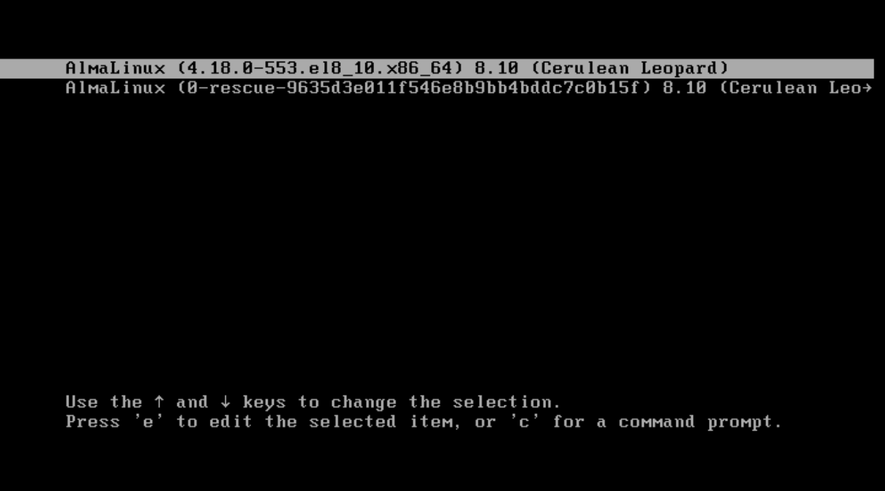

| Entry | Description |
|-------|-------------|
| **AlmaLinux (4.18.0-553.el8_10.x86_64) 8.10 (Cerulean Leopard)** | Normal boot — select this |
| AlmaLinux (0-rescue-...) 8.10 (Cerulean Leopard) | Rescue kernel — for system recovery only |

Select the **first entry** and press **Enter**, or wait for the automatic 5-second countdown.

---

### Step 13: License Agreement

On the first boot, the **Initial Setup** screen requires the EULA to be accepted before proceeding.

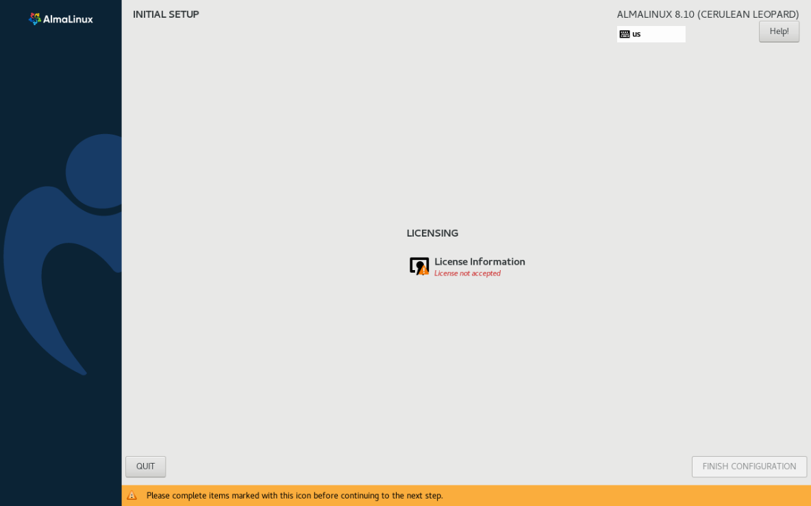

Click **"License Information"** to open the license screen.

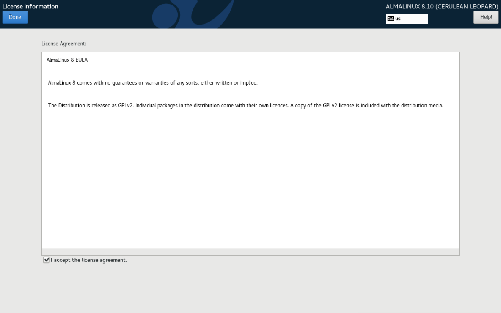

The **AlmaLinux 8 EULA** states:
- AlmaLinux 8 comes with no guarantees or warranties of any sort
- The distribution is released under **GPLv2**
- Individual packages have their own licenses

Check the box **"I accept the license agreement."**, then click **"Done"**.

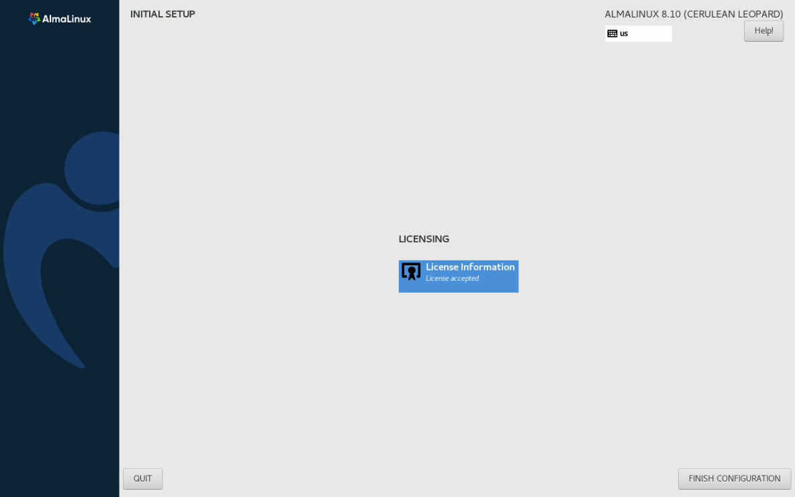

The License Information item now shows **"License accepted"**. Click **"Finish Configuration"** to proceed to the login screen.

---

## Part 5 — First Desktop Login

The **GNOME Display Manager (GDM)** login screen appears.

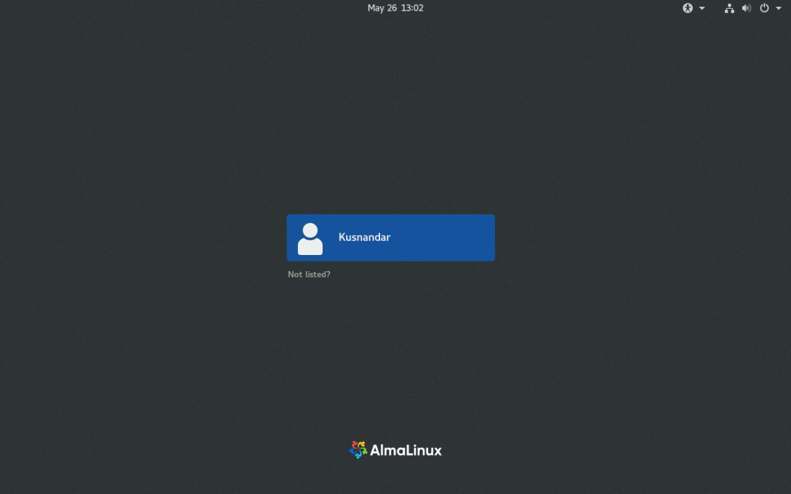

The screen shows the user `Kusnandar` that was created during installation. To log in as **root**, click **"Not listed?"** at the bottom of the user list.

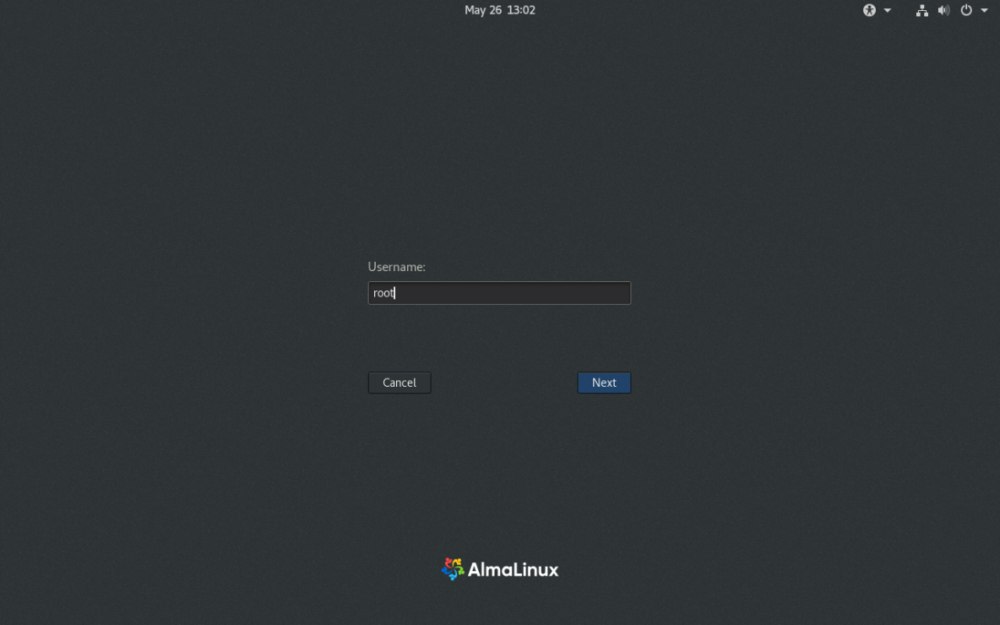

- Type `root` in the username field
- Click **"Next"**

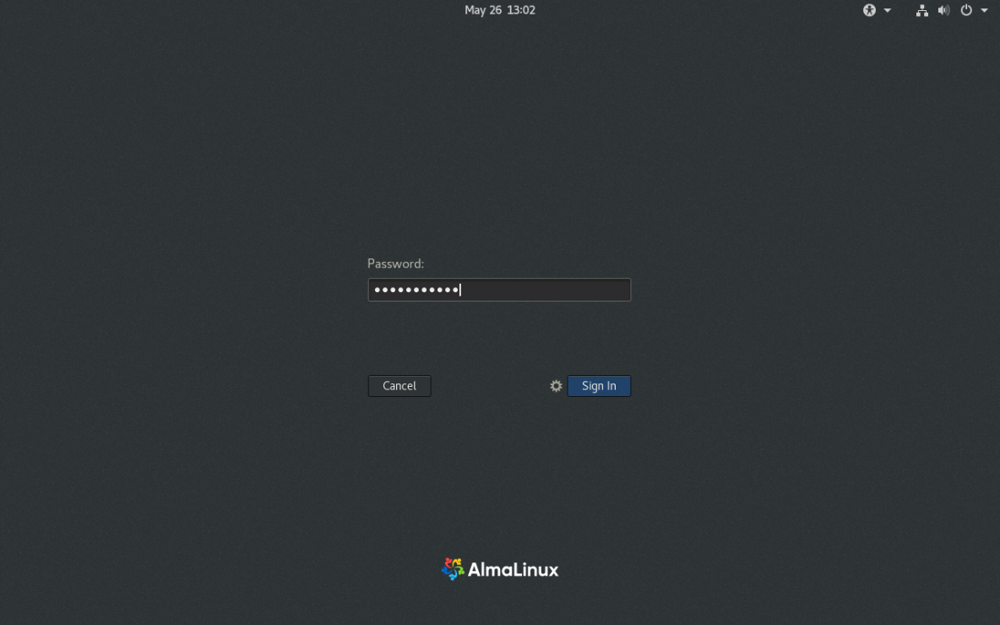

- Enter the root password configured during installation
- Click **"Sign In"**

The GNOME desktop will load for the first time.

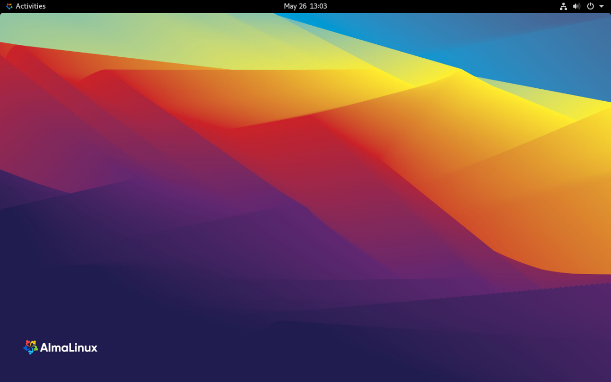

> **Note:** Logging in as `root` on the desktop is acceptable for initial configuration and Oracle DB installation purposes. For day-to-day administration, it is best practice to log in as a regular user and use `sudo` or `su -` for elevated tasks.

---

## Part 6 — GNOME Initial Setup Wizard

On the first login, the **GNOME Initial Setup** wizard automatically starts to guide through final desktop preferences.

### Welcome — Language

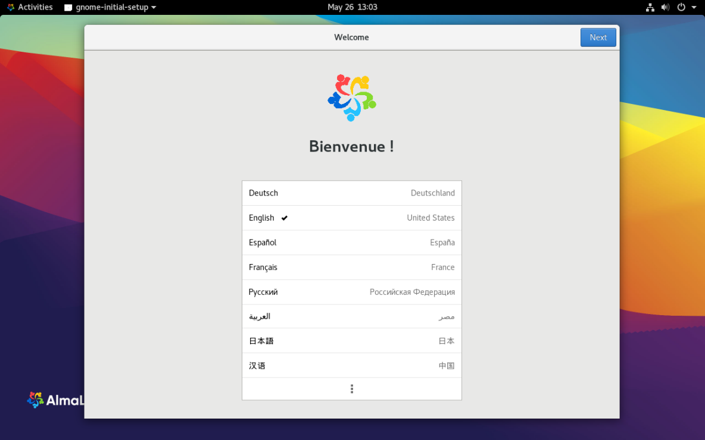

- Select **"English"** → **"United States"** (marked with ✓)
- Click **"Next"**

---

### Typing — Keyboard Layout

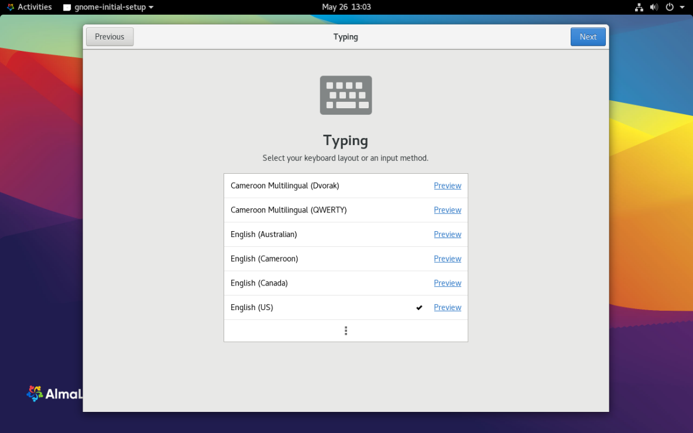

- Verify **"English (US)"** is selected (marked with ✓)
- Click **"Next"**

---

### Privacy Settings

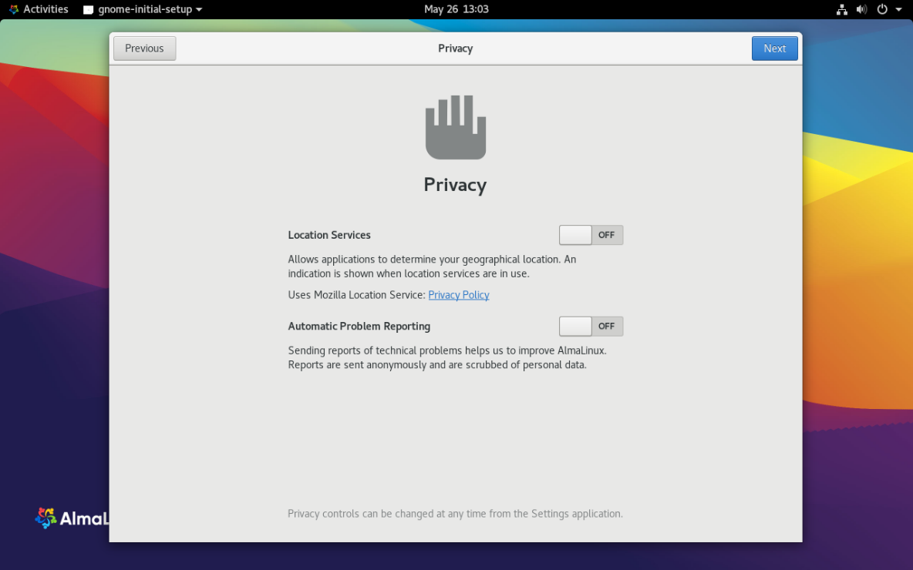

| Setting | Value | Reason |
|---------|-------|--------|
| **Location Services** | OFF | Not required for a database server |
| **Automatic Problem Reporting** | OFF | Prevents anonymous data from being sent externally |

- Set both toggles to **OFF**
- Click **"Next"**

---

### Online Accounts

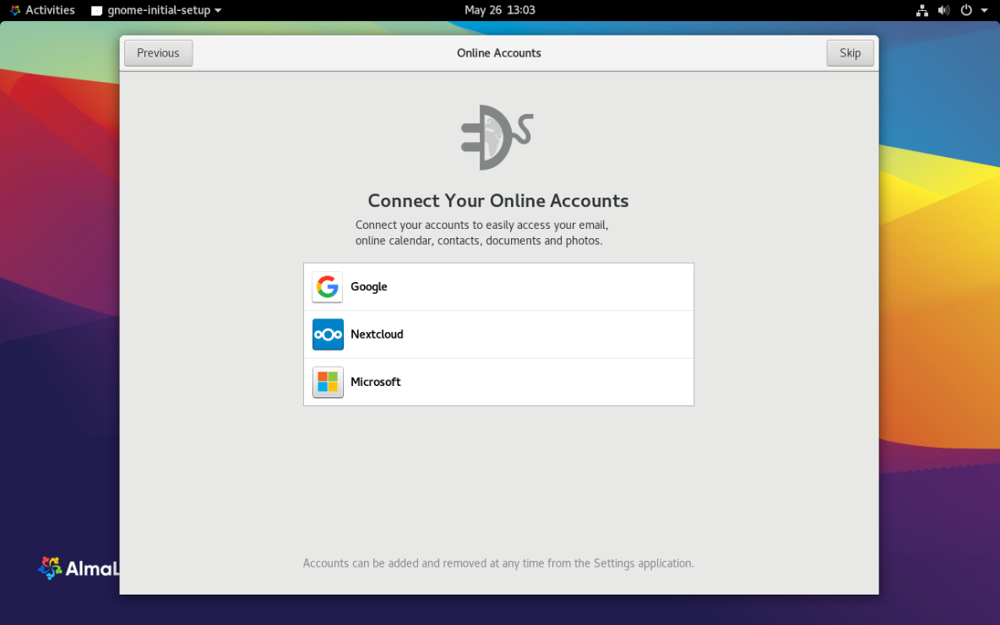

Available account integrations: Google, Nextcloud, Microsoft.

- Click **"Skip"** — online account integration is not needed for a database server

---

### Ready to Go

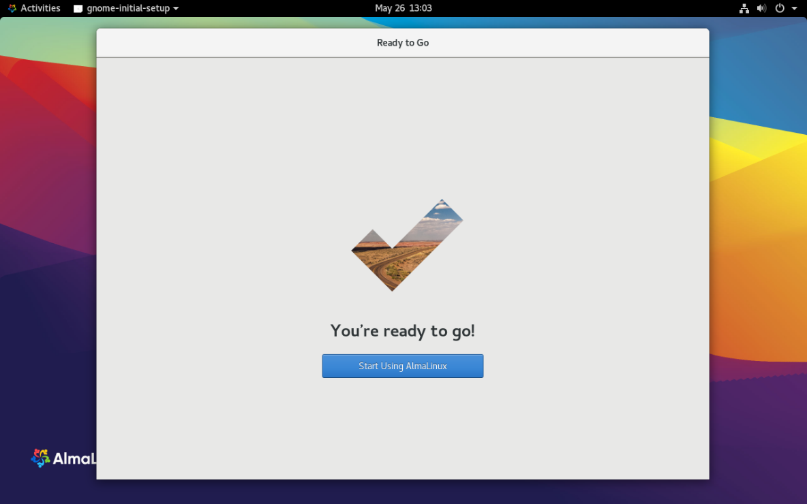

The wizard is complete. Click **"Start Using AlmaLinux"**.

---

### Getting Started

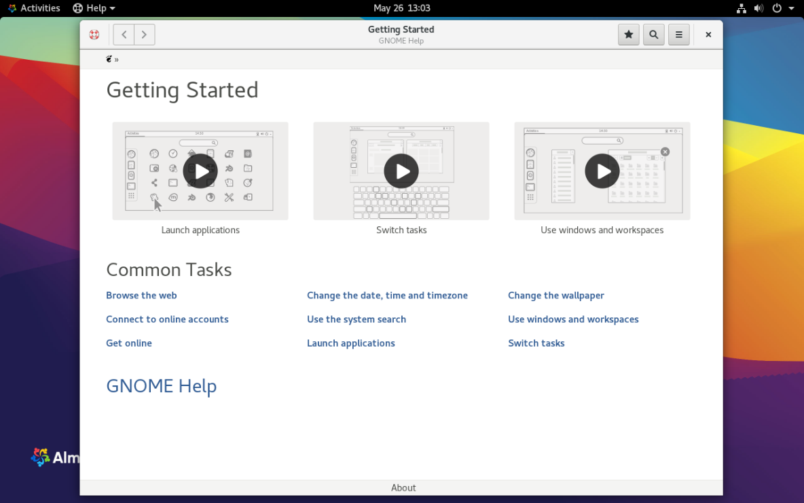

A GNOME Help "Getting Started" window opens automatically. **Close** this window to dismiss it and access the desktop.

---

## Part 7 — Post-Installation CLI Configuration

Open a **Terminal** from the GNOME desktop (Activities → Terminal), or connect remotely via **PuTTY** from a client machine using SSH.

```
SSH connection: login as root to 192.168.159.134
```

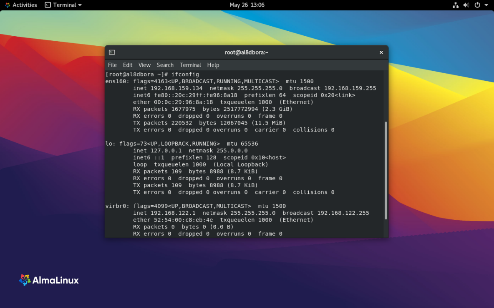

---

### 7.1 Verify Network Interface

Check the active network configuration:

```bash
# ifconfig
```

The output confirms `ens160` is UP with IP address `192.168.159.134/24`.

---

### 7.2 Verify System Date and Time

```bash
# date
Tue May 26 13:07:40 WIB 2026
```

Confirm the timezone is correctly set to WIB (UTC+7).

---

### 7.3 View and Update `/etc/hosts`

View the current hosts file:

```bash
# cat /etc/hosts
127.0.0.1   localhost localhost.localdomain localhost4 localhost4.localdomain4
::1         localhost localhost.localdomain localhost6 localhost6.localdomain6
```

Open the file for editing:

```bash
# vi /etc/hosts
```

> **Vi quick reference:** Press `i` to enter insert mode, make changes, then press `Esc`, type `:wq`, and press `Enter` to save and exit.

Update the file content as follows:

```
127.0.0.1   localhost localhost.localdomain localhost4 localhost4.localdomain4
192.168.159.134 al8dbora.company.com al8dbora
```

Verify the saved changes:

```bash
# cat /etc/hosts
127.0.0.1   localhost localhost.localdomain localhost4 localhost4.localdomain4
192.168.159.134 al8dbora.company.com al8dbora
```

> **Why update `/etc/hosts`?** Oracle Database requires the server's FQDN and short hostname to resolve correctly without depending solely on DNS. The `/etc/hosts` entry ensures the Oracle listener and database can resolve the hostname locally even if DNS is unavailable.

---

### 7.4 Verify Hostname

```bash
# cat /etc/hostname
al8dbora.company.com
```

The hostname was set during installation in the Network & Host Name step and persisted to `/etc/hostname`.

---

### 7.5 Test Internet Connectivity

```bash
# ping 8.8.8.8
PING 8.8.8.8 (8.8.8.8) 56(84) bytes of data.
64 bytes from 8.8.8.8: icmp_seq=1 ttl=128 time=17.1 ms
64 bytes from 8.8.8.8: icmp_seq=2 ttl=128 time=13.5 ms
64 bytes from 8.8.8.8: icmp_seq=3 ttl=128 time=14.3 ms
64 bytes from 8.8.8.8: icmp_seq=4 ttl=128 time=44.0 ms
^C
--- 8.8.8.8 ping statistics ---
4 packets transmitted, 4 received, 0% packet loss, time 3010ms
rtt min/avg/max/mdev = 13.542/22.242/44.016/12.642 ms
```

- **0% packet loss** confirms the network is operational
- Internet access is available for downloading Oracle packages and updates

---

### 7.6 Verify System Information

```bash
# hostnamectl
   Static hostname: al8dbora.company.com
         Icon name: computer-vm
           Chassis: vm
        Machine ID: 930ddaf21fe9465db0ce83144dbf290d
           Boot ID: 331cf5e0e0234f1580bfb8d041ec09ab
    Virtualization: vmware
  Operating System: AlmaLinux 8.10 (Cerulean Leopard)
       CPE OS Name: cpe:/o:almalinux:almalinux:8::baseos
            Kernel: Linux 4.18.0-553.el8_10.x86_64
      Architecture: x86-64
```

**Output verification checklist:**

| Field | Expected Value | Status |
|-------|---------------|--------|
| Static hostname | al8dbora.company.com | ✅ |
| Virtualization | vmware | ✅ |
| Operating System | AlmaLinux 8.10 (Cerulean Leopard) | ✅ |
| Kernel | Linux 4.18.0-553.el8_10.x86_64 | ✅ |
| Architecture | x86-64 | ✅ |

---

## Summary of Key Configurations

| Category | Setting | Configured Value |
|----------|---------|-----------------|
| **OS** | Version | AlmaLinux 8.10 (Cerulean Leopard) |
| **OS** | Kernel | Linux 4.18.0-553.el8_10.x86_64 |
| **OS** | Architecture | x86-64 |
| **Timezone** | Region / City | Asia / Jakarta (WIB, UTC+7) |
| **Network** | Interface | ens160 (VMware VMXNET3) |
| **Network** | IP Address | 192.168.159.134 / 24 |
| **Network** | Default Gateway | 192.168.159.2 |
| **Network** | DNS Server | 192.168.159.2 |
| **Hostname** | FQDN | al8dbora.company.com |
| **Hostname** | Short Name | al8dbora |
| **Users** | Root Account | Enabled (password set) |
| **Users** | Regular User | kusnand (Full name: Kusnandar) |
| **Software** | Base Environment | Server with GUI |
| **Software** | Additional Groups | Debugging Tools, Performance Tools, Legacy UNIX Compatibility, Development Tools, System Tools |
| **KDUMP** | Status | **Disabled** |
| **Security Policy** | Status | **OFF** (No profile selected) |
| **Filesystem Type** | All partitions | XFS |
| **Disk** | `/boot` | 1024 MiB (nvme0n1p1) |
| **Disk** | `/home` | 50 GiB (nvme0n1p2) |
| **Disk** | `/tmp` | 25 GiB (nvme0n1p3) |
| **Disk** | `swap` | 12 GiB (nvme0n1p5) — 2× RAM |
| **Disk** | `/` (root) | 212 GiB (nvme0n1p6) |
| **Disk** | **Total** | **~300 GiB** |

---

## Next Steps

The AlmaLinux 8.10 OS installation is now complete. The system is ready for the Oracle Database 19c installation process, which consists of three stages:

| Stage | Document | Description |
|-------|----------|-------------|
| **1** | [Pre Install Oracle Database 19c](https://github.com/seeomkus/oracle-installation/blob/main/oracle-database-19c-linux-al8/oracle_database_19c_pre_installation_guide_almalinux_8_10.md) | Configure kernel parameters, install required OS packages, create Oracle user/groups, set OS resource limits, configure shared memory |
| **2** | [Install Oracle Database 19c](https://github.com/seeomkus/oracle-installation/blob/main/oracle-database-19c-linux-al8/oracle_database_19c_installation_guide_almalinux_8_10.md) | Run Oracle Universal Installer (OUI), create database instance |
| **3** | [Post Install Oracle Database 19c](https://github.com/seeomkus/oracle-installation/blob/main/oracle-database-19c-linux-al8/oracle_database_19c_post_installation_guide_almalinux_8_10.md) | Configure listeners, create initial database, validate installation |

See the [References](#references) section below for official documentation links.

---

## References

### 1. AlmaLinux Official Documentation

| Document | URL |
|----------|-----|
| **AlmaLinux Wiki (Main)** | https://wiki.almalinux.org |
| **AlmaLinux 8.10 Release Notes** | https://wiki.almalinux.org/release-notes/8.10.html |
| **Installation Guide** | https://wiki.almalinux.org/documentation/installation-guide.html |
| **AlmaLinux GitHub** | https://github.com/AlmaLinux |
| **Community Forum** | https://forums.almalinux.org |
| **AlmaLinux Blog** | https://almalinux.org/blog/ |
| **Bug Tracker** | https://bugs.almalinux.org |

---

### 2. Oracle Database 19c — Related Documentation

| Document | URL |
|----------|-----|
| **Oracle DB 19c Installation Guide for Linux** | https://docs.oracle.com/en/database/oracle/oracle-database/19/ladbi/ |
| **Pre-Installation Requirements (x86-64 Linux)** | https://docs.oracle.com/en/database/oracle/oracle-database/19/ladbi/operating-system-requirements-for-x86-64-linux-platforms.html |
| **Oracle DB 19c Download (requires Oracle account)** | https://www.oracle.com/database/technologies/oracle-database-software-downloads.html |
| **Oracle Linux and AlmaLinux Compatibility** | https://docs.oracle.com/en/database/oracle/oracle-database/19/ladbi/supported-red-hat-enterprise-linux-8-distributions-for-x86-64.html |
| **Oracle Support Matrix** | https://support.oracle.com/knowledge/Oracle%20Database%20Products/742060.1.html |

---

### 3. Supporting Tools

| Tool | Purpose | Download URL |
|------|---------|--------------|
| **PuTTY** | SSH client for remote connection to the Linux server | https://www.putty.org/ |
| **WinSCP** | SFTP/SCP file transfer client (Windows → Linux) | https://winscp.net/ |
| **MobaXterm** | All-in-one terminal (SSH, SFTP, X11 forwarding) | https://mobaxterm.mobatek.net/ |
| **7-Zip** | File archiver — useful for extracting Oracle zip files | https://www.7-zip.org/ |

---

### 4. GPG Key & Security Verification for AlmaLinux

AlmaLinux packages and ISOs are signed with GPG keys. To verify package authenticity:

| Key | Details |
|-----|---------|
| **AlmaLinux OS Foundation GPG Key** | Key ID: `B86B3716` |
| **Key Import URL** | https://repo.almalinux.org/almalinux/RPM-GPG-KEY-AlmaLinux-8 |

```bash
# Import the AlmaLinux GPG key on a Linux system
rpm --import https://repo.almalinux.org/almalinux/RPM-GPG-KEY-AlmaLinux-8

# Verify a downloaded RPM package signature
rpm -K <package.rpm>
```

---

