# Oracle Linux 6.10 — Operating System Installation Guide

> **Platform:** VMware Workstation 16.0.0 | **Purpose:** Preparation for Oracle Database 11g Installation

---

## Table of Contents

1. [Overview](#1-overview)
2. [Prerequisites](#2-prerequisites)
   - 2.1 [Virtual Machine Specifications](#21-virtual-machine-specifications)
   - 2.2 [Software Requirements](#22-software-requirements)
   - 2.3 [Download ISO](#23-download-iso)
   - 2.4 [Disk and Network Planning](#24-disk-and-network-planning)
3. [Part 1 — Boot and Pre-installation Check](#part-1--boot-and-pre-installation-check)
4. [Part 2 — Language, Keyboard, and Storage Type](#part-2--language-keyboard-and-storage-type)
5. [Part 3 — Hostname and Network Configuration](#part-3--hostname-and-network-configuration)
6. [Part 4 — Timezone and Root Password](#part-4--timezone-and-root-password)
7. [Part 5 — Disk Partitioning](#part-5--disk-partitioning)
8. [Part 6 — Software Selection and Installation](#part-6--software-selection-and-installation)
9. [Part 7 — Post-Installation Setup Agent](#part-7--post-installation-setup-agent)
10. [Part 8 — First Login](#part-8--first-login)
11. [Installation Summary](#installation-summary)
12. [Next Steps](#next-steps)
13. [References](#references)

---

## 1. Overview

This guide documents the step-by-step installation of **Oracle Linux Server 6.10** on a VMware virtual machine intended as a platform for **Oracle Database 11g**. Oracle Linux 6.10 is a RHEL 6-compatible enterprise Linux distribution maintained by Oracle Corporation, based on the Red Hat Enterprise Linux 6 source code with Oracle's own Unbreakable Enterprise Kernel (UEK).

The installation uses a **custom disk partitioning layout** with four virtual disks — one for the operating system and three dedicated to Oracle Database datafiles, index files, and archive/backup areas. The network interface is configured as a **Bridge connection** to allow direct LAN connectivity.

---

## 2. Prerequisites

### 2.1 Virtual Machine Specifications

**Demo / Testing Environment (this guide)**

| Component | Specification |
|-----------|--------------|
| **Platform** | VMware Workstation 16.0.0 |
| **Memory** | 4 GB RAM |
| **CPU** | 2 vCPU |
| **Disk 1** | `/dev/sda` — 512 GB (OS, swap, Oracle software) |
| **Disk 2** | `/dev/sdb` — 512 GB (Oracle datafiles → `/u02/oradata`) |
| **Disk 3** | `/dev/sdc` — 512 GB (Oracle index files → `/u03/oraindx`) |
| **Disk 4** | `/dev/sdd` — 512 GB (Oracle FRA, dump, backup → `/u04`) |
| **Network** | Bridge (direct LAN access) |
| **Hostname** | `localhost.localdomain` |

**Production Server Recommendations**

| Component | Minimum (Testing) | Recommended (Production) |
|-----------|-------------------|--------------------------|
| **Memory** | 4 GB (works) | 64 GB (better for DB workloads) |
| **CPU** | 2 cores | 32 cores (improves performance) |
| **Disk 1 (OS & Database Software)** | 300 GB | 500 GB |
| **Disk 2 (Datafile)** | 300 GB | 500 GB |
| **Disk 3 (Datafile — Optional)** | 300 GB | 500 GB |
| **Disk 4 (Backup/RMAN/Archivelog)** | 300 GB | 1 TB |
| **Network** | NAT (OK) | IP Static & Direct Access from Server Database to Storage |

### 2.2 Software Requirements

| Software | Version | Notes |
|----------|---------|-------|
| **Oracle Linux** | 6.10 | RHEL 6-compatible, Database Server profile |
| **VMware Workstation** | 16.0.0 | Hypervisor host |

### 2.3 Download ISO

The Oracle Linux 6.10 ISO is available free of charge from Oracle's public repository:

| Resource | URL |
|----------|-----|
| **Oracle Linux ISO Downloads** | https://yum.oracle.com/oracle-linux-isos.html |
| **Direct — OL 6.10 x86_64 DVD** | https://yum.oracle.com/ISOS/OracleLinux/OL6/u10/x86_64/ |

> **Note:** Oracle Linux is free to download and use. A paid support subscription (Oracle Linux Premier Support) is optional and only required for access to Oracle's Unbreakable Linux Network (ULN).

### 2.4 Disk and Network Planning

**Partition Layout — `/dev/sda` (512 GB OS Disk)**

| Partition | Mount Point | File System | Size | Purpose |
|-----------|-------------|-------------|------|---------|
| `sda1` | `/boot` | ext4 | 400 MB | Boot loader and kernel images |
| `sda2` | `/` | ext4 | ~80 GB | Root filesystem |
| `sda3` | `/home` | xfs | ~20 GB | User home directories |
| `sda4` | — | Extended | ~409 GB | Container for logical partitions |
| `sda5` | `/tmp` | xfs | ~20 GB | Temporary files |
| `sda6` | `[swap]` | swap | 8 GB | Virtual memory swap space |
| `sda7` | `/u01` | xfs | ~372 GB | Oracle Database software home |

**Additional Disks (to be configured post-installation)**

| Device | Mount Point | Purpose |
|--------|-------------|---------|
| `/dev/sdb` | `/u02/oradata` | Oracle datafiles |
| `/dev/sdc` | `/u03/oraindx` | Oracle index files |
| `/dev/sdd` | `/u04/orafra` | Oracle Fast Recovery Area |
| `/dev/sdd` | `/u04/dump` | Oracle dump directory |
| `/dev/sdd` | `/u04/backup` | Oracle backup directory |

**Network**

| Parameter | Value |
|-----------|-------|
| Connection type | Bridge |
| Interface name | `bridge0` |
| IPv4 Method | Automatic (DHCP) |
| IPv6 Method | Ignore |

---

## Part 1 — Boot and Pre-installation Check

### Step 1.1 — Boot from ISO

Mount the Oracle Linux 6.10 ISO to the virtual machine's CD/DVD drive and power on the VM. The Oracle Linux 6 installer boot menu will appear.

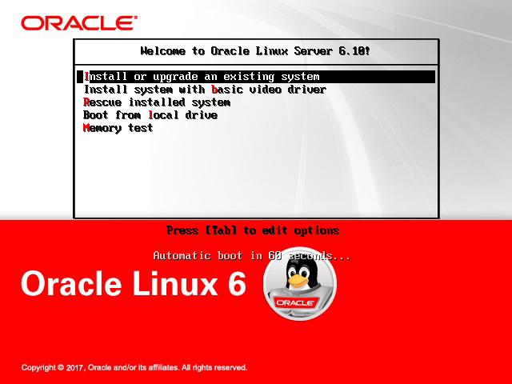

Select **Install or upgrade an existing system** and press **Enter** to start the graphical installer.

> **Options available on the boot menu:**
> - `Install or upgrade an existing system` — Full GUI installer (selected)
> - `Install system with basic video driver` — For systems with incompatible graphics
> - `Rescue installed system` — Recovery mode
> - `Boot from local drive` — Skip installation and boot existing OS
> - `Memory test` — RAM diagnostic utility

### Step 1.2 — Kernel Loading

The installer loads the kernel (`vmlinuz`) and initial RAM disk (`initrd.img`) into memory.


This screen is fully automatic. Wait for the process to complete before proceeding.

### Step 1.3 — Media Integrity Check

The installer will prompt to verify the installation media (ISO/DVD).

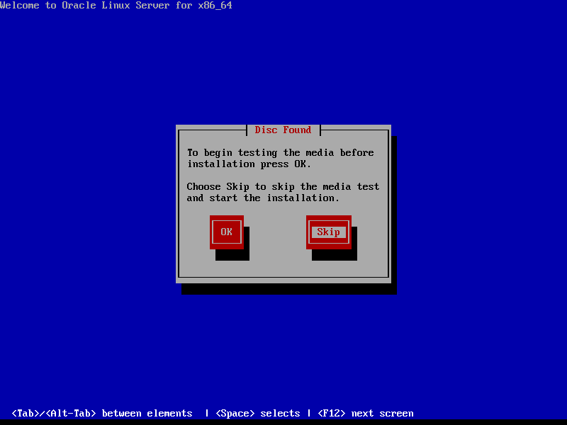

Click **Skip** to bypass the media integrity test and proceed directly to installation. Only run the media test if you suspect your ISO image is corrupted.

### Step 1.4 — Welcome Screen

The Oracle Linux graphical installer welcome screen appears.

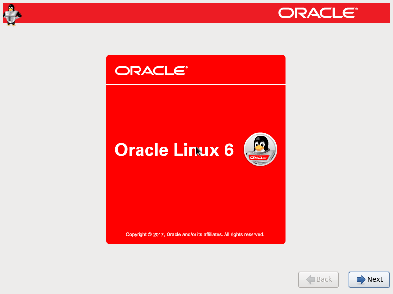

Click **Next** to begin the installation configuration.

---

## Part 2 — Language, Keyboard, and Storage Type

### Step 2.1 — Language Selection

Choose the installation language. This affects the installer interface and the default system locale.

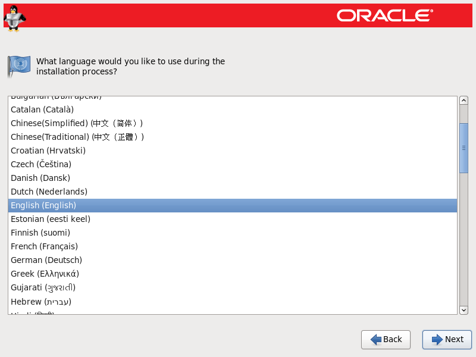

Select **English (English)** and click **Next**.

### Step 2.2 — Keyboard Layout

Select the keyboard layout appropriate for your hardware.

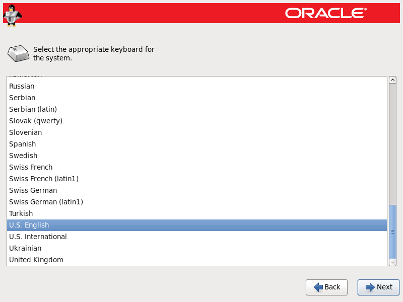

Select **U.S. English** and click **Next**.

### Step 2.3 — Storage Device Type

Choose the type of storage devices for the installation target.

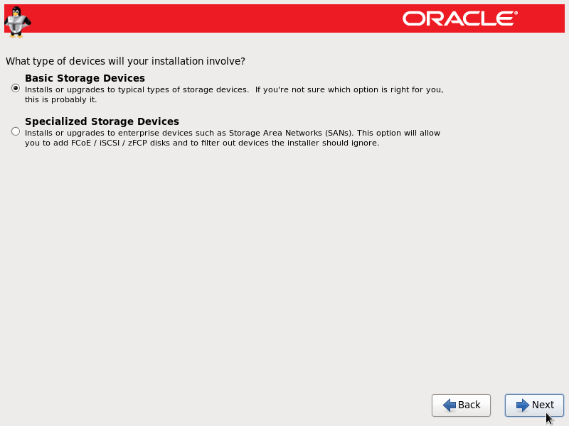

Select **Basic Storage Devices** and click **Next**.

> **When to use each option:**
> - **Basic Storage Devices** — Standard local hard drives and SSDs, VMware virtual disks (SCSI/SATA/NVMe). Use this for most installations.
> - **Specialized Storage Devices** — SAN (Storage Area Network), iSCSI, FCoE, and multipath devices.

### Step 2.4 — Storage Device Warning

The installer detects that the storage devices contain existing data (or are uninitialized) and displays a warning.

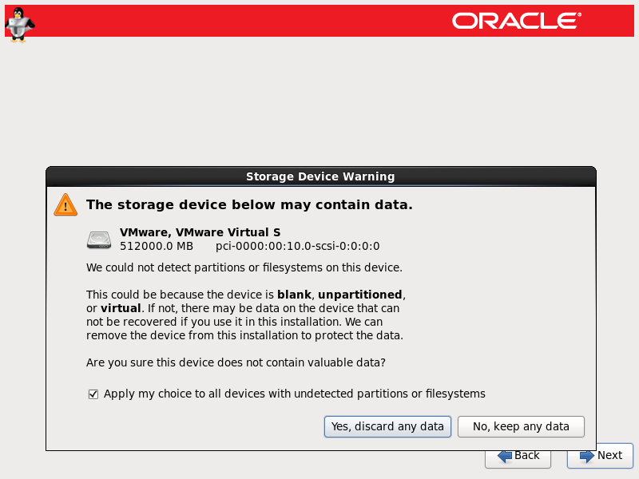

The detected device is **VMware Virtual S 512000 MB** (`/dev/sda`). Check **Apply my choice to all devices with undetected partitions or filesystems** and click **Yes, discard any data**.

> This will destroy all existing partition tables on the detected disks. Since these are freshly created VMware virtual disks, no existing data will be lost.

---

## Part 3 — Hostname and Network Configuration

### Step 3.1 — Set Hostname

Enter the system hostname. The hostname identifies this machine on the network and in Oracle Database configuration files.

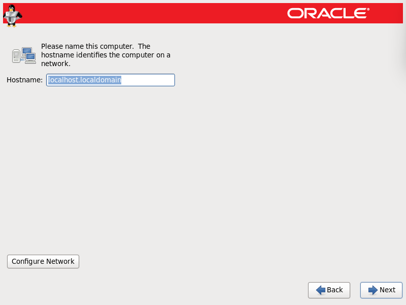

The default hostname shown is `localhost.localdomain`. Leave it as default during installation — the hostname will be configured properly in the post-installation steps via `/etc/sysconfig/network`.

Click **Configure Network** to configure the network interface before continuing.

### Step 3.2 — Add Bridge Network Connection

The Network Connections manager opens. Click **Add** to create a new network connection.

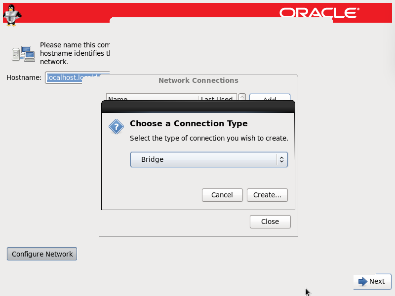

In the **Choose a Connection Type** dialog, select **Bridge** and click **Create**.

> **Why Bridge?** A Bridge connection connects the VM directly to the physical LAN, sharing the same network segment as the host machine. This allows direct IP address assignment from the network's DHCP server and enables the Oracle Database server to be accessible from other machines on the same network without NAT.

### Step 3.3 — Configure Bridge Interface

The **Editing Bridge connection 1** dialog opens. Configure the Bridge tab settings:

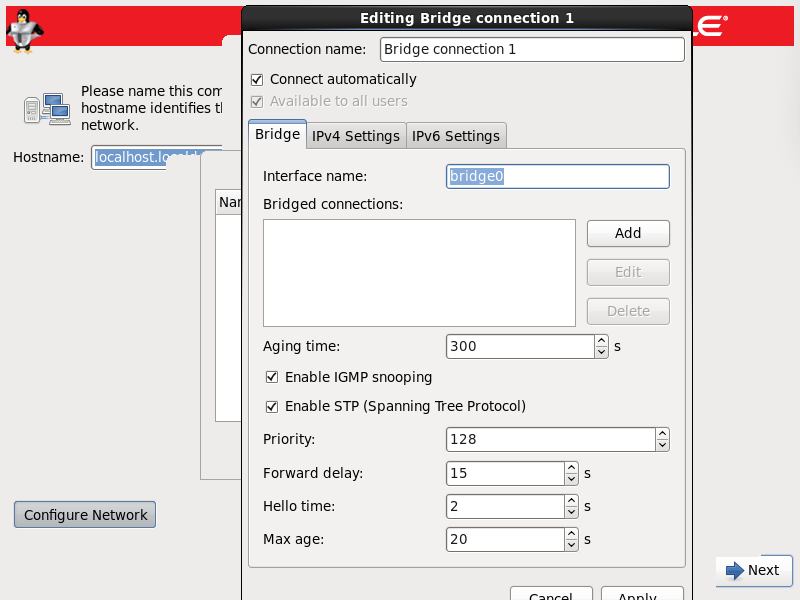

| Field | Value |
|-------|-------|
| **Connection name** | `Bridge connection 1` |
| **Connect automatically** | Checked |
| **Interface name** | `bridge0` |
| **Aging time** | 300 s |
| **Enable IGMP snooping** | Checked |
| **Enable STP (Spanning Tree Protocol)** | Checked |
| **Priority** | 128 |
| **Forward delay** | 15 s |
| **Hello time** | 2 s |
| **Max age** | 20 s |

> Leave **Bridged connections** empty — the bridge will auto-detect the physical interface at boot time.

### Step 3.4 — IPv4 Settings

Click the **IPv4 Settings** tab.

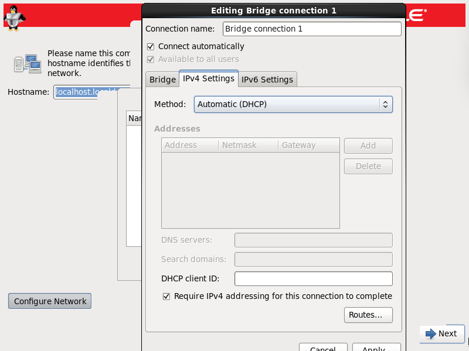

Set **Method** to **Automatic (DHCP)**. The server will receive its IP address automatically from the network DHCP server.

> For a production Oracle Database server, consider setting a static IP address after the OS installation is complete to ensure consistent connectivity. Change the method to **Manual** and add the static address, netmask, gateway, and DNS servers.

### Step 3.5 — IPv6 Settings

Click the **IPv6 Settings** tab.

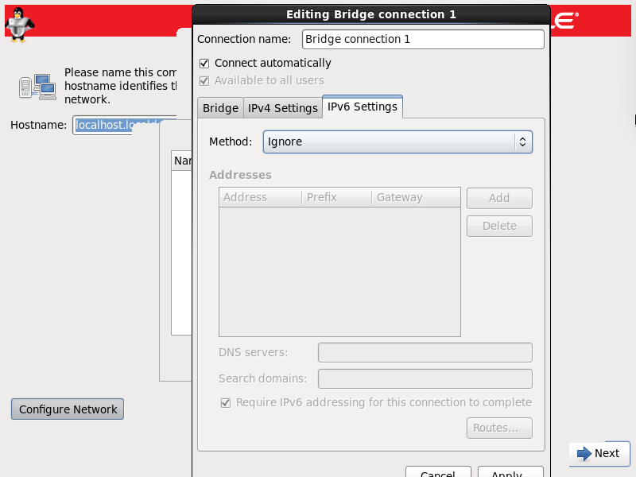

Set **Method** to **Ignore** to disable IPv6 for this interface.

Click **Apply** to save the bridge connection configuration.

### Step 3.6 — Verify Network Connection

The Network Connections manager now shows **Bridge connection 1** listed under the Bridge category.

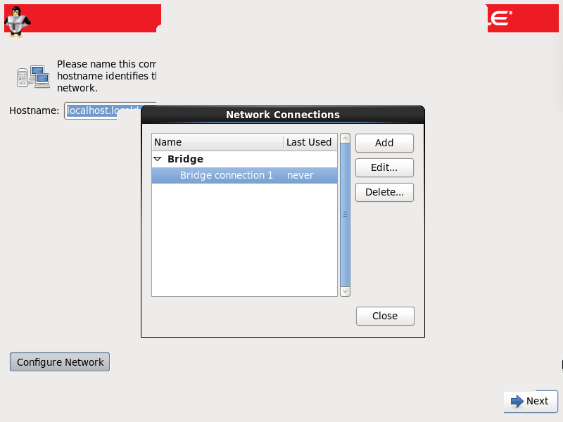

Click **Close** to return to the hostname screen.

### Step 3.7 — Confirm Hostname and Continue

The hostname screen now reflects the confirmed hostname `localhost.localdomain`.

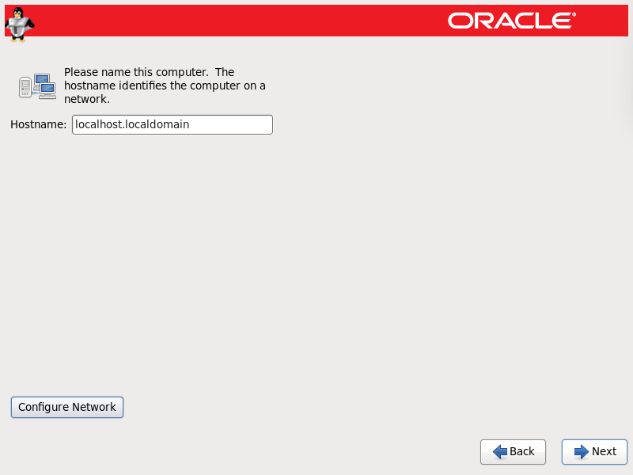

Click **Next** to continue to timezone configuration.

---

## Part 4 — Timezone and Root Password

### Step 4.1 — Timezone Selection

Select the geographic timezone for the server. The installer displays an interactive world map.

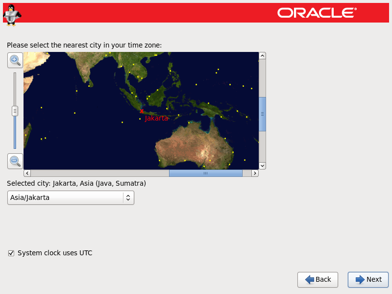

Click on **Jakarta** on the map, or select from the dropdown:

| Setting | Value |
|---------|-------|
| **Selected city** | Jakarta, Asia (Java, Sumatra) |
| **Timezone** | `Asia/Jakarta` |
| **System clock uses UTC** | Checked |

> **Why enable UTC for the hardware clock?** Storing the hardware clock in UTC prevents time-shift issues when switching between timezones or during daylight saving changes. The OS automatically converts UTC to local time for display. This is the recommended setting for all Linux servers, especially Oracle Database servers where consistent timestamps are critical.

Click **Next**.

### Step 4.2 — Root Password

Set the password for the `root` (superuser) account.

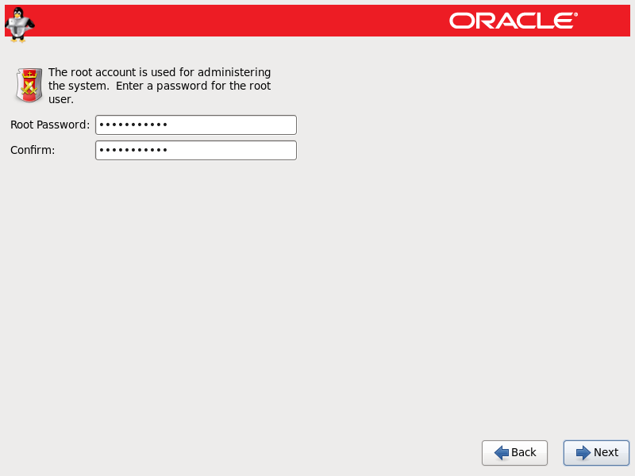

Enter a strong password in both the **Root Password** and **Confirm** fields.

> **Root password requirements for Oracle Database hosts:**
> - Minimum 8 characters
> - Mix of uppercase, lowercase, digits, and special characters
> - Do not reuse the root password as the Oracle OS user password or database SYS/SYSTEM password

Click **Next**.

---

## Part 5 — Disk Partitioning

### Step 5.1 — Select Partitioning Type

Choose how the installer should partition the storage devices.

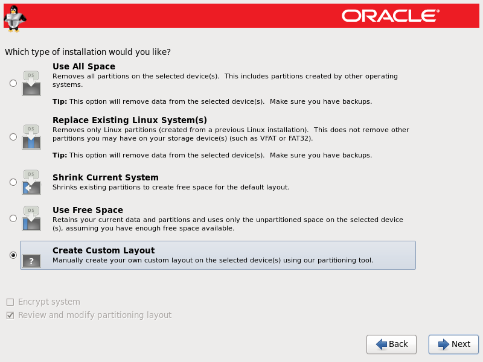

Select **Create Custom Layout** to manually define all partitions.

> **Why Custom Layout?** Oracle Database has specific requirements for filesystem placement:
> - Oracle software (`/u01`) must be on a dedicated, large partition
> - Temporary space (`/tmp`) should be isolated to prevent Oracle installer failures
> - Oracle datafiles, index files, and recovery area go on separate dedicated disks
>
> None of the automated layouts can satisfy these requirements; only Custom Layout gives full control.

Ensure **Review and modify partitioning layout** is checked. Click **Next**.

### Step 5.2 — View Available Devices

The partitioner displays all available storage devices. All four virtual disks are detected with 511993 MB (~500 GB) free each.

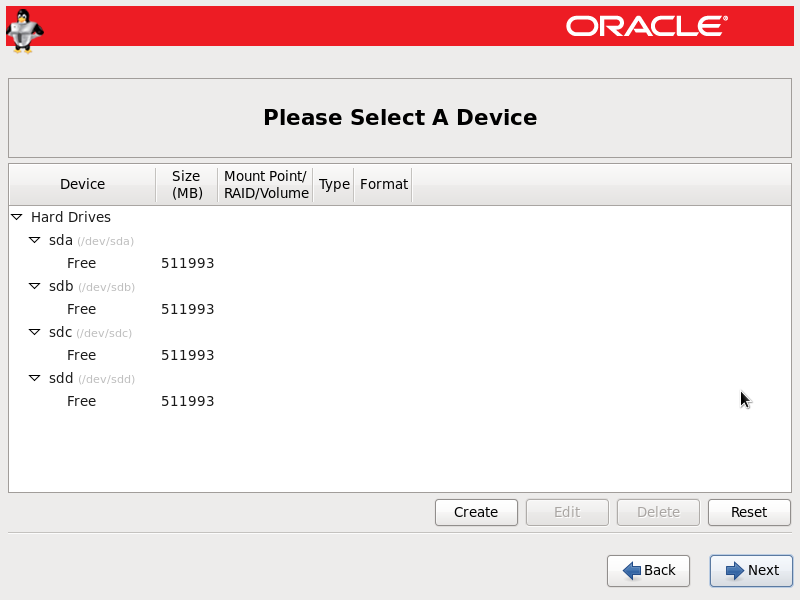

| Device | Path | Size (MB) | Status |
|--------|------|-----------|--------|
| **sda** | `/dev/sda` | 511993 | Free |
| **sdb** | `/dev/sdb` | 511993 | Free |
| **sdc** | `/dev/sdc` | 511993 | Free |
| **sdd** | `/dev/sdd` | 511993 | Free |

### Step 5.3 — Begin Partitioning /dev/sda

Select the **Free** space under `sda (/dev/sda)` and click **Create** to begin creating partitions on the OS disk.

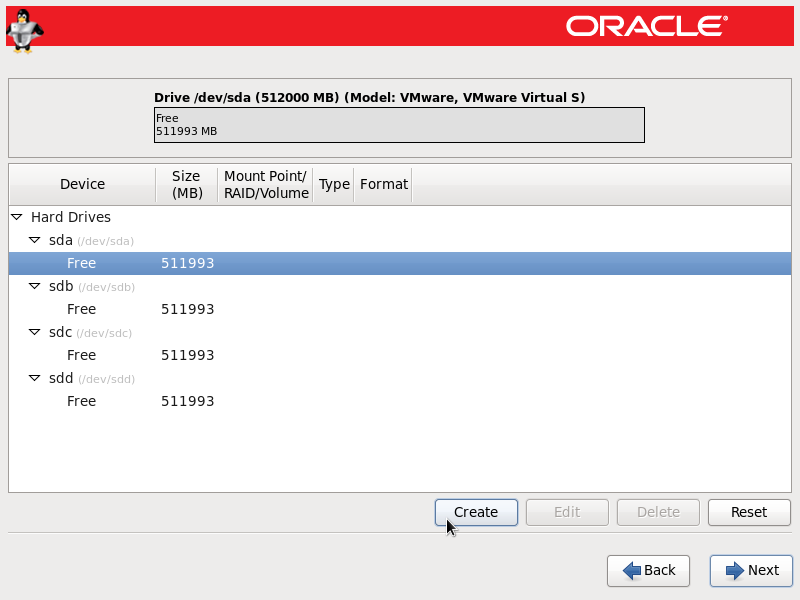

### Step 5.4 — Create Storage Type

The **Create Storage** dialog appears. Select **Standard Partition** and click **Create**.

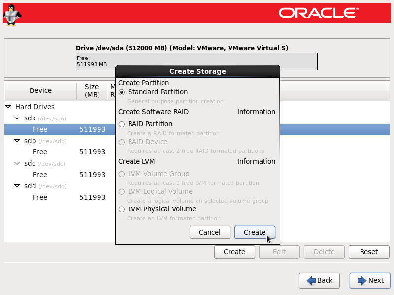

> All partitions in this guide use Standard Partitions, not LVM or RAID. This keeps the layout simple and compatible with Oracle's storage configuration requirements.

### Step 5.5 — Create /boot Partition

Configure the `/boot` partition:

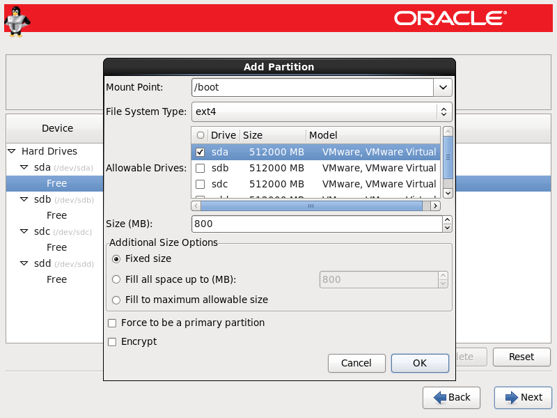

| Field | Value |
|-------|-------|
| **Mount Point** | `/boot` |
| **File System Type** | `ext4` |
| **Allowable Drives** | `sda` (checked) |
| **Size (MB)** | `800` |
| **Additional Size Options** | Fixed size |

Click **OK**.

> `/boot` **must** use `ext4` — Oracle Linux 6.10 does not support XFS for the `/boot` partition. The GRUB boot loader in OL6 can only read `ext4` (or `ext3`) filesystems. Using XFS on `/boot` will cause the system to fail to boot.

### Step 5.6 — Create Swap Partition

Click **Create** again (Standard Partition) and configure the swap partition:

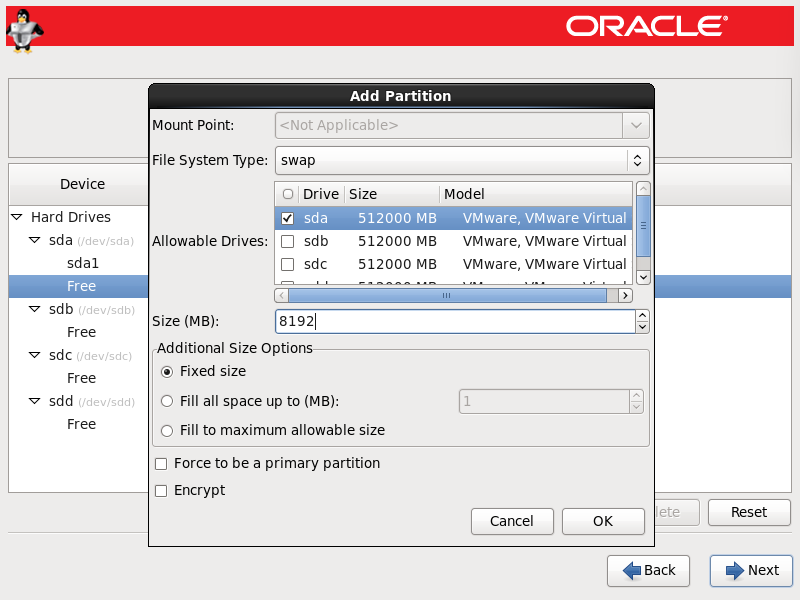

| Field | Value |
|-------|-------|
| **Mount Point** | N/A (Not Applicable) |
| **File System Type** | `swap` |
| **Allowable Drives** | `sda` (checked) |
| **Size (MB)** | `8192` |
| **Additional Size Options** | Fixed size |

Click **OK**.

> **Note:** The 8 GB swap size used here is for documentation demo purposes on a VMware VM with 4 GB RAM. For production Oracle Database servers, follow Oracle's official swap sizing recommendation based on the actual physical memory installed.

### Step 5.7 — Create /home Partition

Click **Create** and configure the `/home` partition:

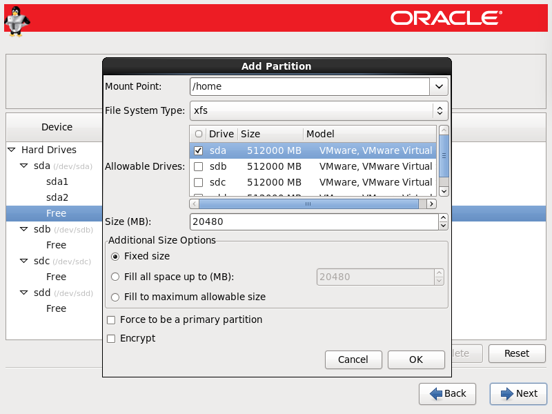

| Field | Value |
|-------|-------|
| **Mount Point** | `/home` |
| **File System Type** | `xfs` |
| **Allowable Drives** | `sda` (checked) |
| **Size (MB)** | `20480` |
| **Additional Size Options** | Fixed size |

Click **OK**.

### Step 5.8 — Create /tmp Partition

Click **Create** and configure the `/tmp` partition:

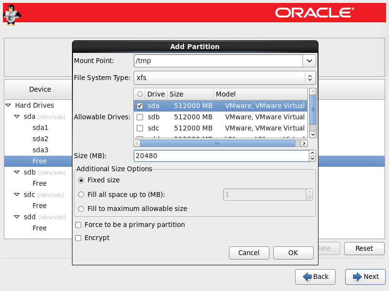

| Field | Value |
|-------|-------|
| **Mount Point** | `/tmp` |
| **File System Type** | `xfs` |
| **Allowable Drives** | `sda` (checked) |
| **Size (MB)** | `20480` |
| **Additional Size Options** | Fixed size |

Click **OK**.

> Oracle Database installer writes large temporary files to `/tmp`. A dedicated `/tmp` partition prevents the root filesystem from filling up during installation.

### Step 5.9 — Create / (Root) Partition

Click **Create** and configure the root (`/`) partition:

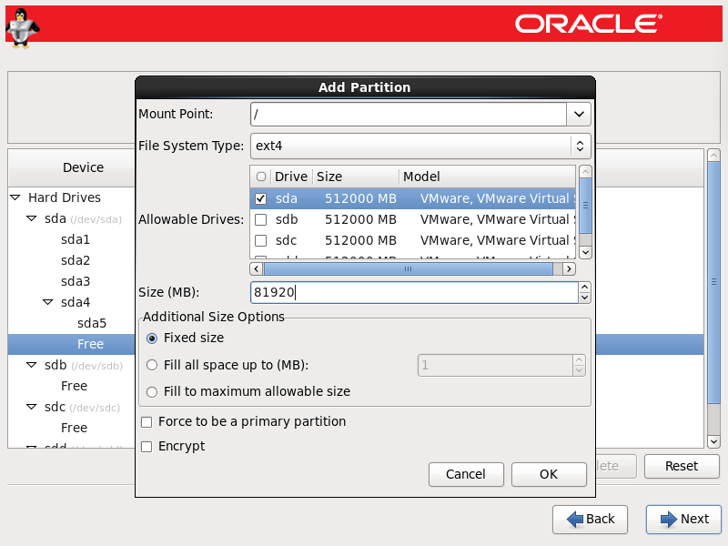

| Field | Value |
|-------|-------|
| **Mount Point** | `/` |
| **File System Type** | `ext4` |
| **Allowable Drives** | `sda` (checked) |
| **Size (MB)** | `81920` |
| **Additional Size Options** | Fixed size |

Click **OK**.

> The root (`/`) filesystem **must** use `ext4` — Oracle Linux 6.10 does not support XFS for the root filesystem. XFS support for `/` was not introduced until Oracle Linux 7. The 80 GB size provides sufficient space for the OS, system logs, and additional RPM packages.

### Step 5.10 — Create /u01 Partition

Click **Create** and configure the `/u01` (Oracle software home) partition:

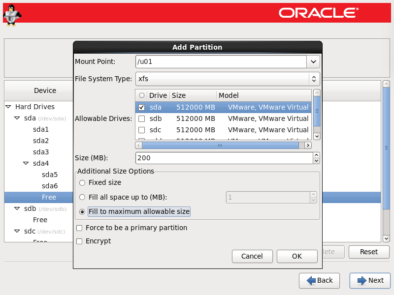

| Field | Value |
|-------|-------|
| **Mount Point** | `/u01` |
| **File System Type** | `xfs` |
| **Allowable Drives** | `sda` (checked) |
| **Size (MB)** | `200` (minimum) |
| **Additional Size Options** | **Fill to maximum allowable size** |

Click **OK**.

> By selecting **Fill to maximum allowable size**, this partition consumes all remaining free space on `/dev/sda` after all other partitions have been allocated. `/u01` will contain the Oracle Database software installation (`$ORACLE_BASE` and `$ORACLE_HOME`).

### Step 5.11 — Review Final Partition Layout

The completed partition layout for `/dev/sda` is displayed. Verify all partitions are correct before proceeding.

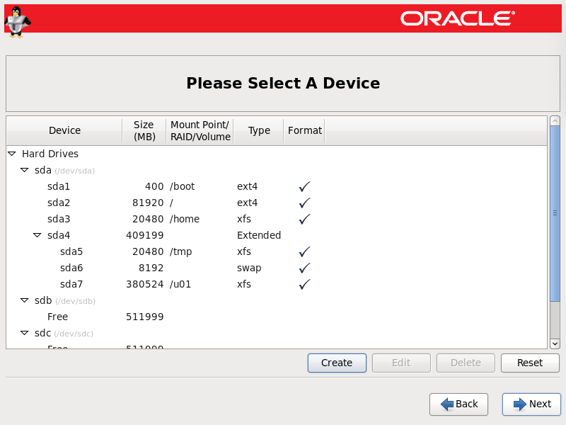

| Partition | Size (MB) | Mount Point | Type | Format |
|-----------|-----------|-------------|------|--------|
| `sda1` | 400 | `/boot` | ext4 | ✓ |
| `sda2` | 81920 | `/` | ext4 | ✓ |
| `sda3` | 20480 | `/home` | xfs | ✓ |
| `sda4` | 409199 | — | Extended | — |
| `sda5` | 20480 | `/tmp` | xfs | ✓ |
| `sda6` | 8192 | `[swap]` | swap | ✓ |
| `sda7` | 380524 | `/u01` | xfs | ✓ |

> **Note:** `/dev/sdb`, `/dev/sdc`, and `/dev/sdd` remain unpartitioned at this stage. They will be partitioned and mounted to `/u02/oradata`, `/u03/oraindx`, and `/u04` after the OS is installed, as part of the Oracle Database pre-installation steps.

Click **Next**.

### Step 5.12 — Partitioning Warning

The installer may display a warning about the absence of a dedicated swap partition if its detection logic is inconsistent. This can be safely dismissed.

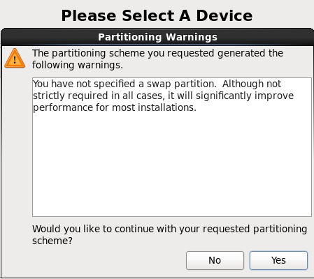

Click **Yes** to proceed with the requested partitioning scheme.

> The warning appears because the installer sometimes fails to detect the swap partition when Extended partitions are involved. The swap partition (`sda6`) has been correctly defined in the previous steps.

### Step 5.13 — Format Warnings

The installer warns that all four disks will be formatted, destroying all existing data.

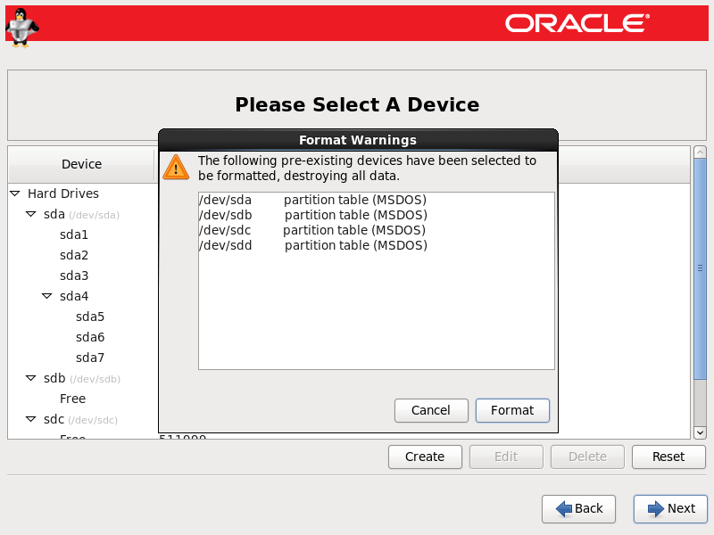

The following devices will be formatted:

| Device | Partition Table |
|--------|----------------|
| `/dev/sda` | MSDOS |
| `/dev/sdb` | MSDOS |
| `/dev/sdc` | MSDOS |
| `/dev/sdd` | MSDOS |

Click **Format** to confirm.

### Step 5.14 — Write Changes to Disk

The final confirmation before changes are written to disk.

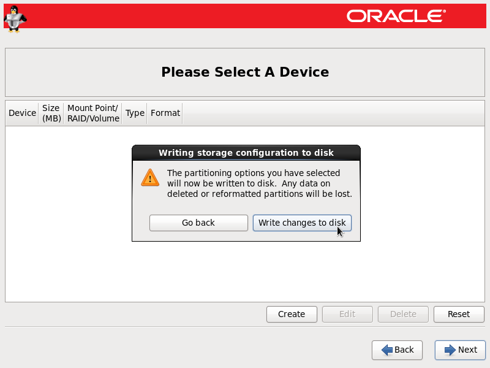

> **This is the point of no return.** After clicking **Write changes to disk**, the partition tables will be written and formatting will begin. All existing data on the target disks will be permanently destroyed.

Click **Write changes to disk** to apply the partition layout and begin formatting.

---

## Part 6 — Software Selection and Installation

### Step 6.1 — Boot Loader Configuration

Configure where GRUB (the boot loader) will be installed.

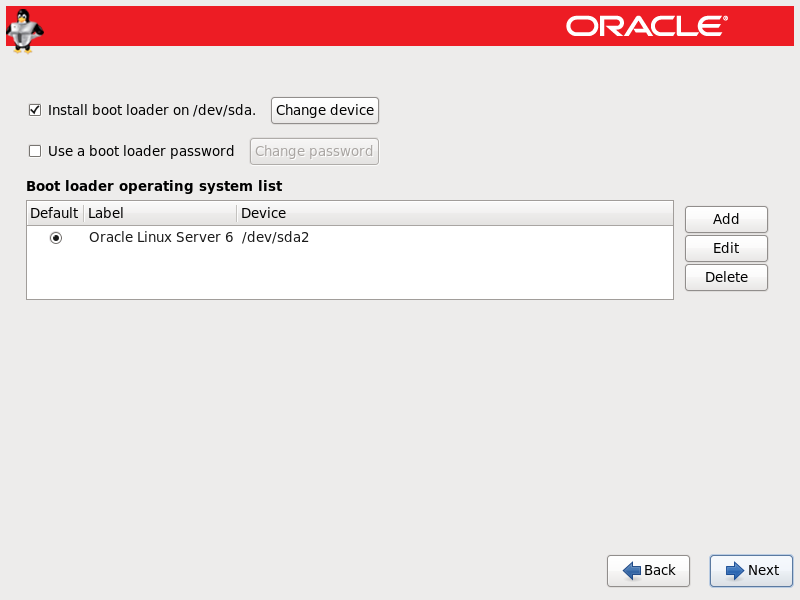

| Setting | Value |
|---------|-------|
| **Install boot loader on** | `/dev/sda` |
| **Use a boot loader password** | Unchecked |
| **Default OS** | Oracle Linux Server 6 → `/dev/sda2` |

Click **Next** to accept the defaults.

> Installing GRUB to the MBR of `/dev/sda` (the first disk) is the standard configuration. Do not install it to a partition (e.g., `/dev/sda1`).

### Step 6.2 — Software Selection

Select the software group appropriate for an Oracle Database host.

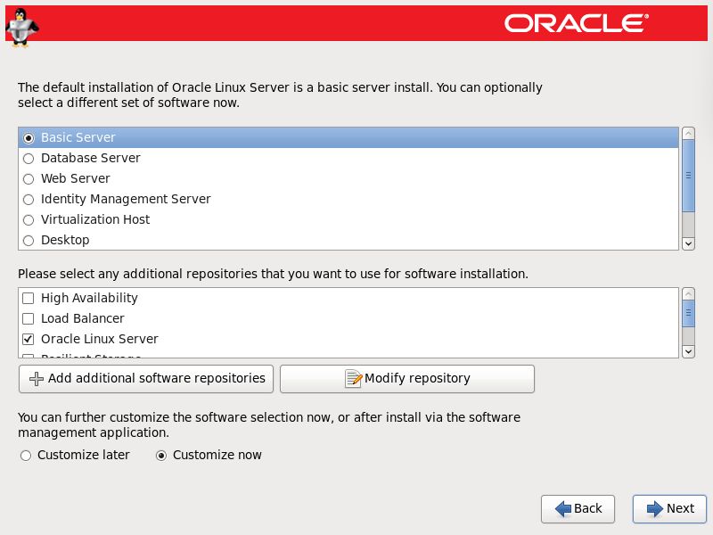

| Setting | Value |
|---------|-------|
| **Installation type** | **Basic Server** |
| **Oracle Linux Server** repository | Checked |
| **Customize** | **Customize now** |

Select **Basic Server** from the list. This is the default minimal server profile. The required packages for Oracle Database will be added through the package customization step.

Under additional repositories, ensure **Oracle Linux Server** is checked.

Select **Customize now** to review and modify the package selection. Click **Next**.

### Step 6.3 — Package Customization

The package customization screen allows fine-grained selection of installed components.

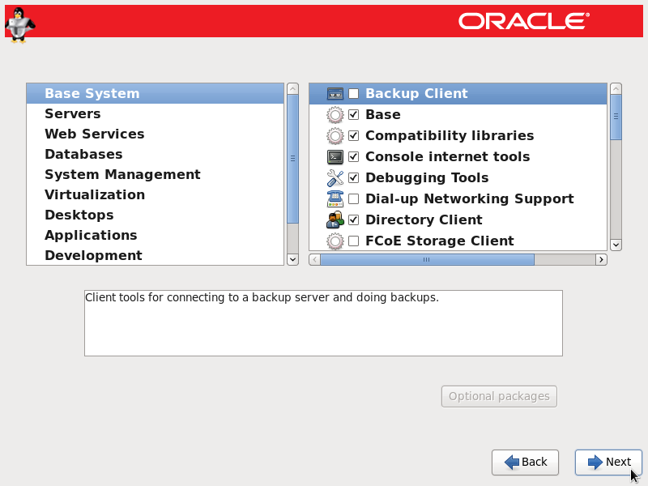

The following package groups were selected during this installation. Use the category list on the left panel to navigate between groups:

**Base System**

| Package Group | Status | Purpose |
|---------------|--------|---------|
| **Base** | ✓ Checked | Core system utilities |
| **Client management tools** | ✓ Checked | System management client tools |
| **Compatibility libraries** | ✓ Checked | 32-bit compatibility for Oracle DB |
| **Hardware monitoring utilities** | ✓ Checked | Hardware sensor monitoring tools |
| **Network file system client** | ✓ Checked | NFS client support |
| **Performance Tools** | ✓ Checked | System performance analysis tools |
| **Perl Support** | ✓ Checked | Perl runtime (required by Oracle scripts) |

**Servers**

| Package Group | Status | Purpose |
|---------------|--------|---------|
| **Server Platform** | ✓ Checked | Core server platform packages |
| **System administration tools** | ✓ Checked | Admin utilities (`lvm2`, `mdadm`, etc.) |

**Desktops**

| Package Group | Status | Purpose |
|---------------|--------|---------|
| **Desktop** | ✓ Checked | GNOME desktop environment |
| **Desktop Platform** | ✓ Checked | Desktop platform libraries |
| **Fonts** | ✓ Checked | System fonts |
| **General Purpose Desktop** | ✓ Checked | Common desktop applications |
| **Graphical Administration Tools** | ✓ Checked | GUI admin tools (system-config-*) |
| **Input Methods** | ✓ Checked | Keyboard and input method support |
| **X Window System** | ✓ Checked | X11 display server (required for Oracle GUI installer) |

**Development**

| Package Group | Status | Purpose |
|---------------|--------|---------|
| **Additional Development** | ✓ Checked | Extra development headers and libraries |
| **Development Tools** | ✓ Checked | GCC, make, binutils (required by Oracle) |

**Applications**

| Package Group | Status | Purpose |
|---------------|--------|---------|
| **Internet Browser** | ✓ Checked | Firefox web browser |

> **Why install a Desktop and X Window System on a database server?**
> Oracle Database 11g's graphical installer (OUI — Oracle Universal Installer) requires an active X11 display to run. Installing the X Window System and GNOME Desktop allows the Oracle installer to be launched directly on the server console without needing X11 forwarding over SSH.
>
> **Compatibility libraries** is critical for Oracle Database 11g — Oracle's installer and binaries include 32-bit components that require 32-bit shared libraries (e.g., `glibc.i686`, `libstdc++.i686`).
>
> **Development Tools** (GCC compiler) and **Perl Support** are required by Oracle's root scripts (`root.sh`) and post-install utilities.

Click **Next** when satisfied with the selection.

### Step 6.4 — Installation Progress

The installer begins the package installation process. A progress bar shows the number of completed packages.

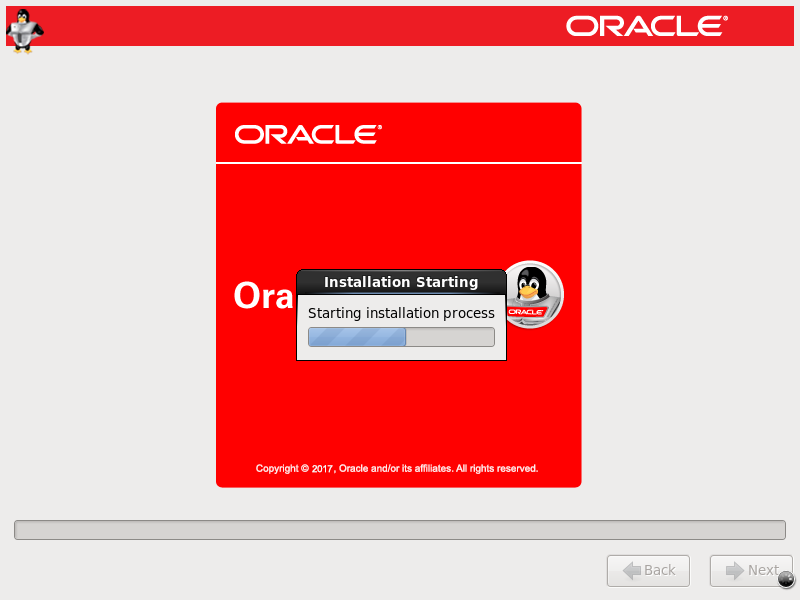

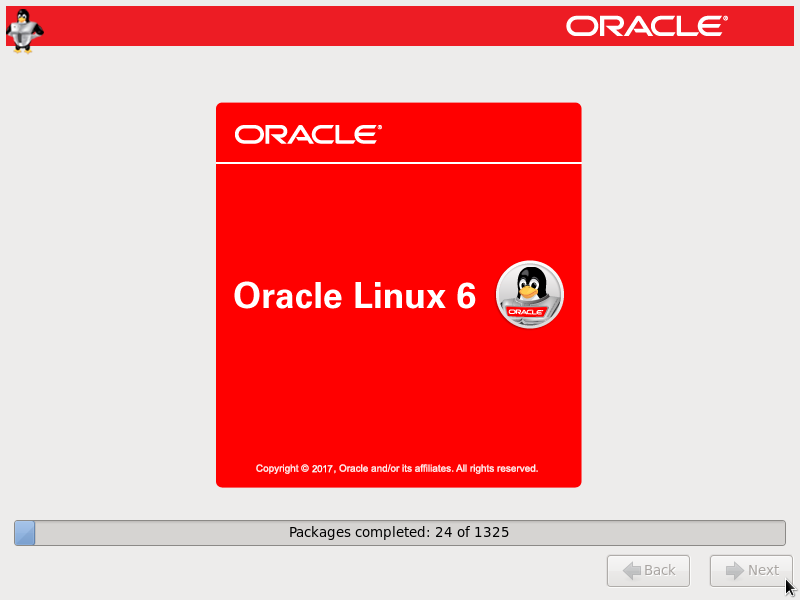

The Database Server profile installs approximately **1325 packages**. Installation time varies depending on hardware speed — typically 10–30 minutes on a modern system.

### Step 6.5 — Installation Complete

When all packages have been installed successfully, the completion screen is displayed.

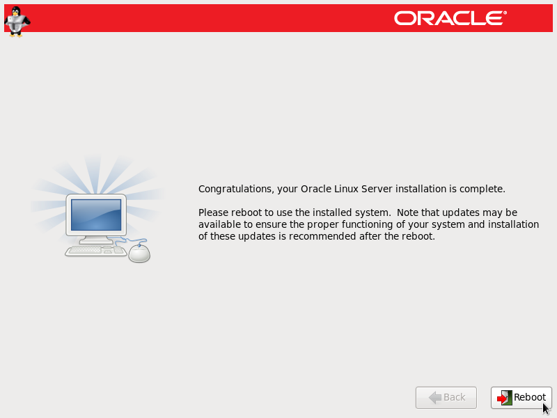

> "Congratulations, your Oracle Linux Server installation is complete. Please reboot to use the installed system."

Click **Reboot** to restart the virtual machine. Remove or disconnect the ISO from the CD/DVD drive before the reboot to prevent booting back into the installer.

---

## Part 7 — Post-Installation Setup Agent

After the first reboot, the **Oracle Linux Setup Agent** (firstboot) runs automatically to complete the initial system configuration.

### Step 7.1 — Welcome Screen

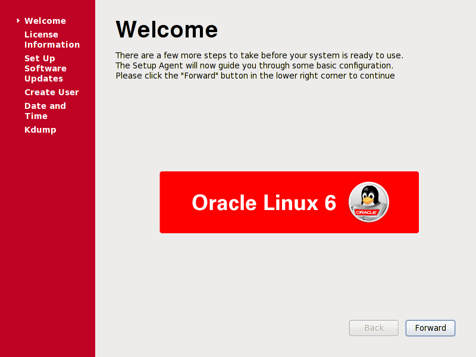

The setup agent lists the configuration steps in the left panel:
- Welcome
- License Information
- Set Up Software Updates
- Create User
- Date and Time
- Kdump

Click **Forward** to begin.

### Step 7.2 — License Agreement

Review and accept the Oracle Linux License Agreement.

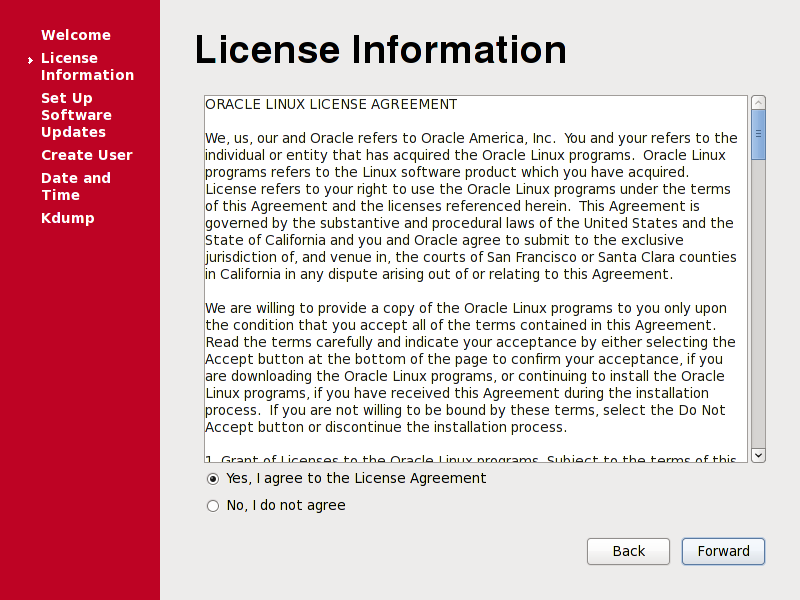

Select **Yes, I agree to the License Agreement** and click **Forward**.

### Step 7.3 — Software Updates Configuration

The setup agent checks for network connectivity to configure Oracle's Unbreakable Linux Network (ULN).

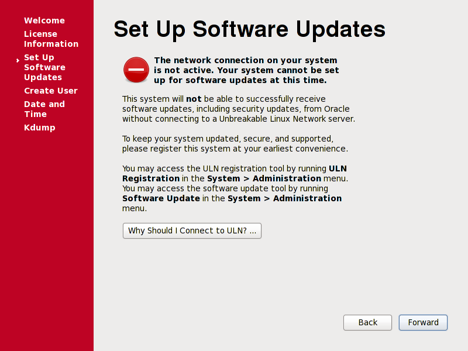

At this stage the network connection may not yet be fully active. The warning is expected:

> "The network connection on your system is not active. Your system cannot be set up for software updates at this time."

Click **Forward** to skip ULN registration for now. Software updates and ULN registration can be configured later by running:

```bash
# Register with Oracle Unbreakable Linux Network (requires Oracle Support account)
uln_register

# Or use yum with public Oracle Linux repos (free, no account required)
# Edit /etc/yum.repos.d/ to add the Oracle public yum repository
```

### Step 7.4 — Create User

The setup agent prompts to create a regular (non-root) user account.

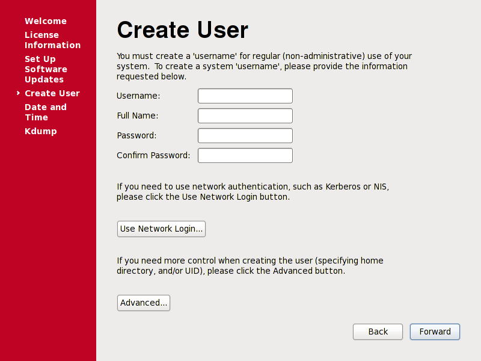

For an Oracle Database server, this step can be skipped for now (leave all fields blank and click **Forward**). The Oracle-specific OS users (`oracle`, `grid`) will be created during the Oracle Database pre-installation steps.

> **Never use root for routine Oracle Database administration.** Oracle software must be installed and operated under a dedicated OS user account (conventionally named `oracle`) that belongs to the `dba` and `oinstall` groups.

### Step 7.5 — Date and Time

Verify or adjust the system date and time.

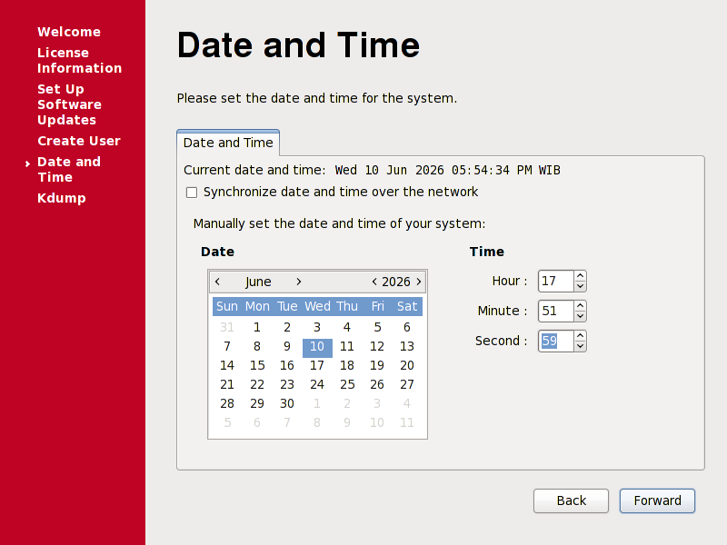

Confirm the current date, time, and timezone are correct. The timezone was set to `Asia/Jakarta` (WIB, UTC+7) during installation.

> For production Oracle Database servers, configure **NTP (Network Time Protocol)** synchronization to maintain accurate timestamps. Enable the **Synchronize date and time over the network** checkbox and configure an NTP server.

Click **Forward**.

### Step 7.6 — Kdump Configuration

Kdump is a kernel crash dumping mechanism that captures memory contents when a kernel panic occurs.

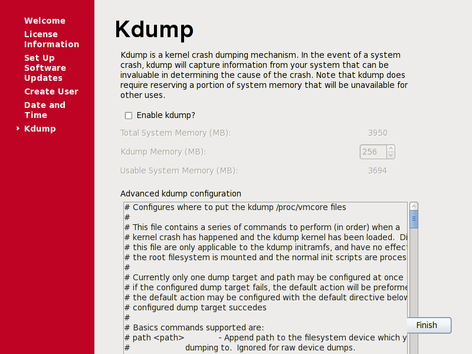

| Setting | Value |
|---------|-------|
| **Enable kdump** | Unchecked (disabled) |
| **Total System Memory** | 3950 MB |
| **Kdump Memory** | 256 MB (reserved if enabled) |
| **Usable System Memory** | 3694 MB |

Leave kdump **disabled** (unchecked) for this Oracle Database VM to preserve the full 4 GB RAM for Oracle's SGA (System Global Area) and PGA (Program Global Area).

> If kdump is needed for kernel debugging, note that enabling it reserves 256 MB of RAM permanently, reducing the memory available to Oracle's AMM (Automatic Memory Management).

Click **Finish**.

### Step 7.7 — Kdump Change Confirmation

If the kdump setting was changed from its default, the system prompts for a reboot to reallocate memory.

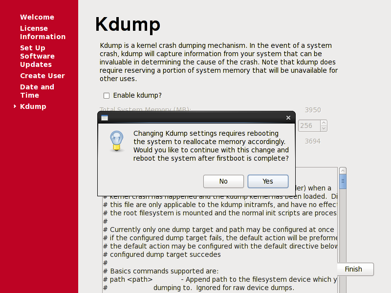

Click **No** if no change was made (kdump was already disabled), or **Yes** if a change was applied and a reboot is required.

### Step 7.8 — Reboot Notification

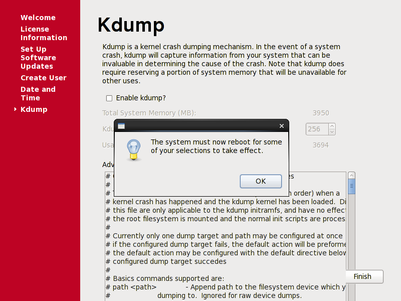

If a reboot is required, click **OK** and the system will restart automatically to apply the kdump memory configuration.

---

## Part 8 — First Login

### Step 8.1 — GUI Login Screen

After the reboot completes, the Oracle Linux 6.10 graphical desktop manager (GDM) login screen is displayed.

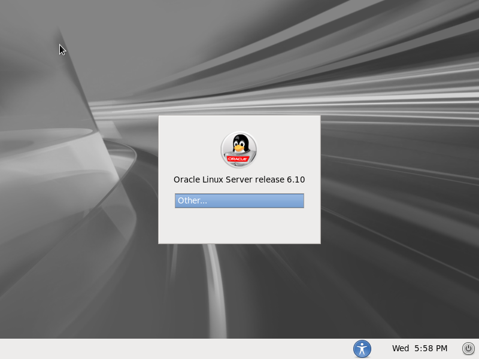

The login screen shows **Oracle Linux Server release 6.10**. Click **Other...** to enter a username manually.

### Step 8.2 — Enter Username

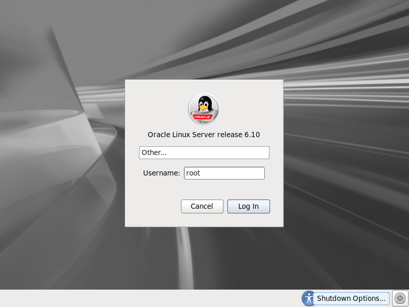

Enter `root` in the Username field and click **Log In**.

### Step 8.3 — Enter Password

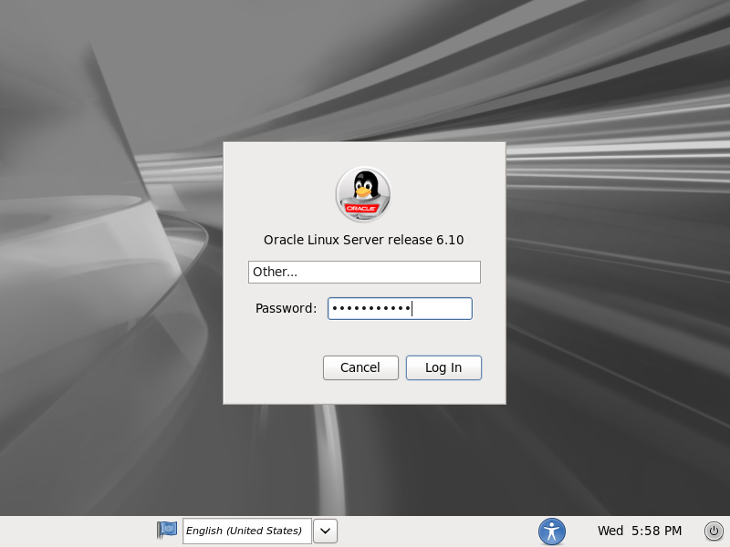

Enter the root password set during installation and click **Log In**.

### Step 8.4 — Desktop Loaded — Root Warning

The GNOME desktop environment loads. A security warning dialog appears.

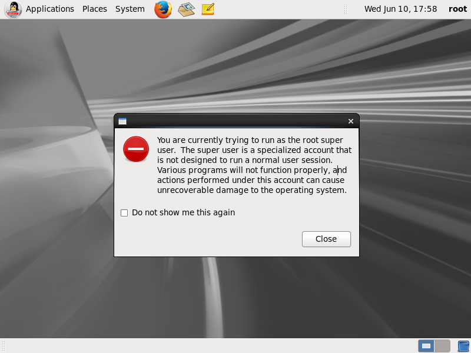

> "You are currently trying to run as the root super user. The super user is a specialized account that is not designed to run a normal user session. Various programs will not function properly, and actions performed under this account can cause unrecoverable damage to the operating system."

This warning is expected when logging into the GUI as root. For initial system configuration this is acceptable; in normal operation, always log in as a regular user and use `su` or `sudo` for administrative tasks.

Click **Close** to dismiss the warning. The Oracle Linux 6.10 desktop is now fully operational.

---

## Installation Summary

The Oracle Linux 6.10 operating system has been successfully installed and is ready for Oracle Database 11g pre-installation configuration.

### What Was Configured

| Category | Configuration |
|----------|--------------|
| **OS** | Oracle Linux Server 6.10 |
| **Hostname** | `localhost.localdomain` |
| **Timezone** | Asia/Jakarta (UTC+7), hardware clock in UTC |
| **Network** | Bridge connection (`bridge0`), DHCP |
| **Boot Loader** | GRUB on `/dev/sda` MBR |
| **Software Profile** | Database Server + Compatibility libraries |
| **Root Account** | Configured with secure password |

### Partition Summary

| Mount Point | Device | Filesystem | Size |
|-------------|--------|------------|------|
| `/boot` | `sda1` | ext4 | 400 MB |
| `/` | `sda2` | ext4 | ~80 GB |
| `/home` | `sda3` | xfs | ~20 GB |
| `/tmp` | `sda5` | xfs | ~20 GB |
| `[swap]` | `sda6` | swap | 8 GB |
| `/u01` | `sda7` | xfs | ~372 GB |
| `/u02/oradata` | `sdb` | *(pending)* | 512 GB |
| `/u03/oraindx` | `sdc` | *(pending)* | 512 GB |
| `/u04` | `sdd` | *(pending)* | 512 GB |

### Post-Installation Steps

#### 1. Configure Network Interface (eth0)

Since this VM uses **NAT** in VMware, the `eth0` interface must be created manually and configured to come up automatically at OS startup.

Create the network script for `eth0`:

```bash
cat > /etc/sysconfig/network-scripts/ifcfg-eth0 << EOF
DEVICE=eth0
TYPE=Ethernet
ONBOOT=yes
BOOTPROTO=dhcp
EOF
```

Bring up the `eth0` interface:

```bash
ifup eth0
```

Restart the network service and verify:

```bash
service network restart
ifconfig -a
```

Test internet connectivity:

```bash
ping 8.8.8.8
```

#### 2. Configure Hostname and Network

Create the network configuration file to ensure `eth0` and the hostname are recognized at OS startup:

```bash
cat > /etc/sysconfig/network << EOF
NETWORKING=yes
HOSTNAME=localhost
EOF
```

#### 3. Configure Date and Time (NTP)

Check the current system time and timezone configuration:

```bash
date
cat /etc/sysconfig/clock
ls -l /etc/localtime
```

Stop the NTP service, sync time manually, then start the service:

```bash
service ntpd stop
ntpdate pool.ntp.org
service ntpd start
```

Verify the system time is correct:

```bash
date
```

---

## Next Steps

| # | Guide | Description |
|---|-------|-------------|
| **1** | [Install Oracle Database 11g on Oracle Linux 6.10](https://github.com/seeomkus/oracle-installation/blob/main/oracle-database-11g-linux-ol6/oracle-database-11g-installation-linux-ol6.md) | Oracle Universal Installer (OUI), listener config, database creation |

---

## References

| Resource | URL |
|----------|-----|
| **Oracle Linux 6 Documentation** | https://docs.oracle.com/cd/E37670_01/ |
| **Oracle Linux 6.10 Release Notes** | https://docs.oracle.com/cd/E37670_01/E67082/html/index.html |
| **Oracle Linux ISO Downloads** | https://yum.oracle.com/oracle-linux-isos.html |
| **Oracle Database 11g Release 2 Installation Guide (Linux)** | https://docs.oracle.com/cd/E11882_01/install.112/e47689/toc.htm |
| **Oracle Linux Public Yum Server** | https://yum.oracle.com |
| **Oracle Linux Support Policies** | https://www.oracle.com/linux/support/ |
| **VMware Workstation Documentation** | https://docs.vmware.com/en/VMware-Workstation-Pro/ |
