# Oracle Linux 9.6 — Operating System Installation Guide

> **Platform:** VMware Workstation 16.0.0 | **Purpose:** Preparation for Oracle Database 26 Installation

| | |
|---|---|
| **Document** | Installation Guide |
| **OS Version** | Oracle Linux Server 9.6 |
| **Platform** | VMware Workstation 16.0.0 |
| **Purpose** | Preparation for Oracle Database 26 Installation |
| **Kernel** | Linux 6.12.0-1.23.3.2.el9uek.x86_64 (UEK) |
| **Architecture** | x86-64 |

---

## Table of Contents

1. [Overview](#1-overview)
2. [Prerequisites](#2-prerequisites)
   - [2.1 Virtual Machine Specifications](#21-virtual-machine-specifications)
   - [2.2 Software Requirements](#22-software-requirements)
   - [2.3 Downloading Oracle Linux 9.6 ISO](#23-downloading-oracle-linux-96-iso)
   - [2.4 Target Network Configuration](#24-target-network-configuration)
3. [Part 1 — Boot from Installation Media](#part-1--boot-from-installation-media)
4. [Part 2 — Installation Configuration](#part-2--installation-configuration)
   - [Step 1: Language Selection](#step-1-language-selection)
   - [Step 2: Installation Summary Overview](#step-2-installation-summary-overview)
   - [Step 3: Time & Date](#step-3-time--date)
   - [Step 4: Root Password](#step-4-root-password)
   - [Step 5: User Account Creation](#step-5-user-account-creation)
   - [Step 6: KDUMP Configuration](#step-6-kdump-configuration)
   - [Step 7: Network & Hostname](#step-7-network--hostname)
   - [Step 8: Security Policy](#step-8-security-policy)
   - [Step 9: Software Selection](#step-9-software-selection)
   - [Step 10: Installation Destination (Disk Partitioning)](#step-10-installation-destination-disk-partitioning)
   - [Step 11: Final Installation Summary & Begin Installation](#step-11-final-installation-summary--begin-installation)
5. [Part 3 — Installation Process](#part-3--installation-process)
6. [Part 4 — Initial Setup After Reboot](#part-4--initial-setup-after-reboot)
   - [Step 12: GRUB Boot Menu](#step-12-grub-boot-menu)
   - [Step 13: Initial Setup Wizard Launch](#step-13-initial-setup-wizard-launch)
7. [Part 5 — Initial Setup Wizard (Account Creation)](#part-5--initial-setup-wizard-account-creation)
8. [Part 6 — Setup Complete & First Desktop](#part-6--setup-complete--first-desktop)
9. [Part 7 — Post-Installation CLI Configuration](#part-7--post-installation-cli-configuration)
10. [Summary of Key Configurations](#summary-of-key-configurations)
11. [Next Steps](#next-steps)
12. [References](#references)
    - [Oracle Linux Official Documentation](#1-oracle-linux-official-documentation)
    - [Oracle Database 26 — Related Documentation](#2-oracle-database-26--related-documentation)
    - [Supporting Tools](#3-supporting-tools)
    - [GPG Key & Security Verification](#4-gpg-key--security-verification-for-oracle-linux)

---

## 1. Overview

This guide provides detailed, step-by-step instructions for installing **Oracle Linux Server 9.6** on a **VMware Workstation 16.0.0** virtual machine. The installation is specifically configured to serve as the operating system layer for **Oracle Database 26**, with settings tuned for compatibility and performance.

**Oracle Linux 9.6** is Oracle's own enterprise-grade Linux distribution, binary-compatible with Red Hat Enterprise Linux (RHEL) 9.6 and shipped with the **Unbreakable Enterprise Kernel (UEK)** by default. It is the reference platform used and supported by Oracle for Oracle Database deployments.

---

## 2. Prerequisites

### 2.1 Virtual Machine Specifications

Before booting the installer, the virtual machine is provisioned in VMware Workstation with the following hardware:

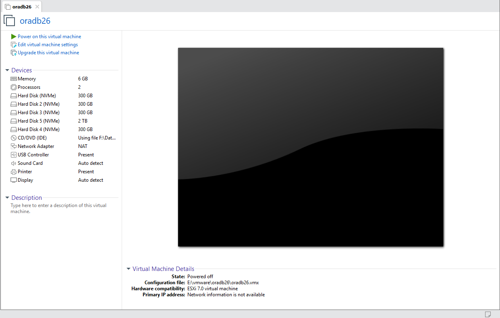

| Component | Specification |
|-----------|---------------|
| **VM Name** | oradb26 |
| **Platform** | VMware Workstation 16.0.0 |
| **RAM** | 6 GB (minimum recommended for Oracle Database) |
| **Processors** | 2 vCPU |
| **Disk (OS Installation)** | 300 GB (VMware Virtual NVMe Disk — `nvme0n1`) |
| **Additional Disks (reserved, untouched)** | 3× 300 GB + 1× 2 TB (VMware Virtual NVMe Disks — `nvme0n2`–`nvme0n5`), reserved for Oracle Database storage/ASM, not used during OS installation |
| **Network Adapter** | VMware VMXNET3 Ethernet Controller (NAT) |
| **Architecture** | x86-64 |
| **Virtualization** | VMware (detected by `hostnamectl`) |

> **Note on additional disks:** Only the first 300 GB NVMe disk (`nvme0n1`) is selected and partitioned during OS installation. The remaining four disks are left untouched at this stage and can be allocated later for Oracle Database data files, redo logs, or ASM disk groups.

### 2.2 Software Requirements

- VMware Workstation 16.0.0 or later installed on the host machine
- Oracle Linux 9.6 ISO installation image — see [Section 2.3](#23-downloading-oracle-linux-96-iso) for download details
- PuTTY or any SSH client for remote management after installation

---

### 2.3 Downloading Oracle Linux 9.6 ISO

Before starting the installation, download the Oracle Linux 9.6 ISO image from the official source.

#### Official Download Page

| Resource | URL |
|----------|-----|
| **Main Download Page** | https://linux.oracle.com/ |
| **Oracle Linux ISO & Vagrant Boxes** | https://yum.oracle.com/oracle-linux-isos.html |
| **Direct Repository (x86_64)** | https://yum.oracle.com/ISOS/OracleLinux/OL9/u6/x86_64/ |

#### Available ISO Types for x86_64

| ISO Type | Approx. Size | Description | Recommended For |
|----------|-------------|-------------|-----------------|
| **Full ISO** | ~9 GB | Full offline install — all packages included | ✅ **This guide** — no internet needed during install |
| **Boot ISO** | ~1 GB | Minimal boot only — downloads packages from internet | Online/network install |
| **Source ISO** | Varies | Source RPMs | Package rebuilding/auditing |

> **For this guide, download `OracleLinux-R9-U6-x86_64-dvd.iso` (Full ISO)** — it contains all required package groups for a complete offline Server with GUI installation.

#### ISO Filename Reference

```
OracleLinux-R9-U6-x86_64-dvd.iso       ← Full offline install (recommended)
OracleLinux-R9-U6-x86_64-boot.iso      ← Network boot only
```

#### Verifying ISO Integrity (Checksum)

After downloading, verify the ISO checksum to confirm the file is not corrupted or tampered:

```bash
# The checksum file is available in the same directory as the ISO:
# OracleLinux-R9-U6-x86_64-dvd.sha256sum.txt

# On Linux / macOS
sha256sum -c OracleLinux-R9-U6-x86_64-dvd.sha256sum.txt

# On Windows (PowerShell)
Get-FileHash OracleLinux-R9-U6-x86_64-dvd.iso -Algorithm SHA256
# Compare the hash output against the value published on yum.oracle.com
```

> **Security Note:** Always verify the checksum before attaching the ISO to the VM to ensure the image is authentic and complete.

---

### 2.4 Target Network Configuration

| Parameter | Value |
|-----------|-------|
| **IP Address** | 192.168.159.145 / 24 |
| **Default Gateway** | 192.168.159.2 |
| **DNS Server** | 192.168.159.2 |
| **Network Interface** | ens160 |
| **FQDN (Hostname)** | oradb26.company.com |
| **Short Hostname** | oradb26 |
| **IP Assignment** | Dynamic (DHCP) — local VMware NAT network |

> **Note:** A dynamic IP is used because this VM runs on a local PC under VMware NAT. For a static IP in a production environment, configure the interface manually after installation or during the network setup step.

---

## Part 1 — Boot from Installation Media

Power on the virtual machine and boot from the attached Oracle Linux 9.6 ISO image. The GRUB boot menu will appear after a few seconds.

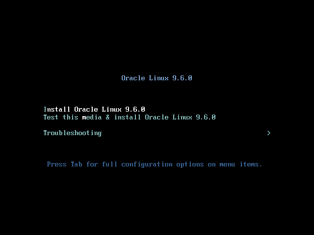

**Available options:**

| Option | Description |
|--------|-------------|
| **Install Oracle Linux 9.6.0** | Proceed directly to the installation |
| Test this media & install Oracle Linux 9.6.0 | Verify ISO integrity before installing (slower) |
| Troubleshooting | Access rescue/recovery mode |

Select **"Install Oracle Linux 9.6.0"** using the arrow keys and press **Enter**.

The kernel loads and the system reaches basic boot targets before the graphical installer (Anaconda) starts:

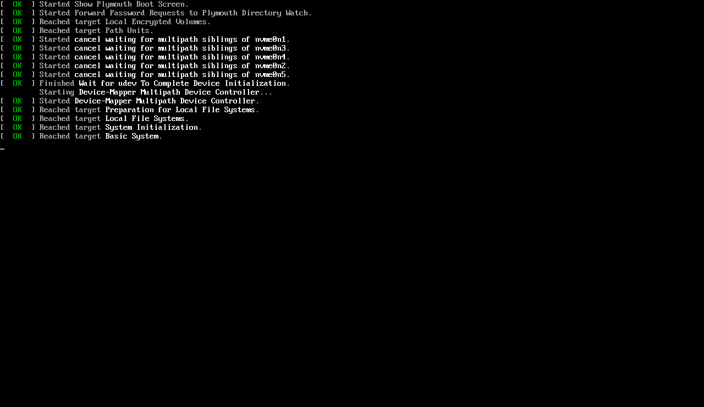

---

## Part 2 — Installation Configuration

### Step 1: Language Selection

The graphical installer (Anaconda) will load and display the language selection screen.

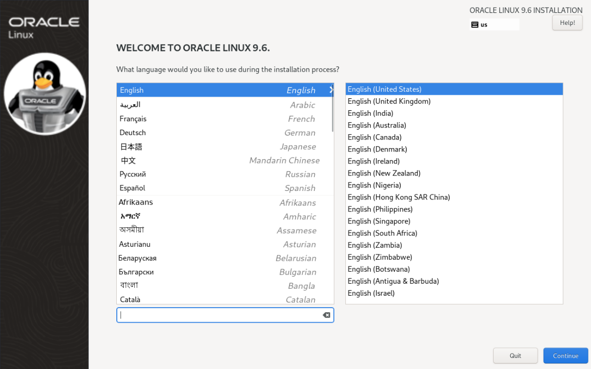

- From the **left panel**, select **"English"**
- From the **right panel**, select **"English (United States)"**
- Click **"Continue"**

> Using English as the installation language is recommended for server environments, as most documentation, log messages, and error outputs are in English.

---

### Step 2: Installation Summary Overview

After language selection, the **Installation Summary** screen appears. This is the central configuration hub — all settings must be configured here before installation begins.

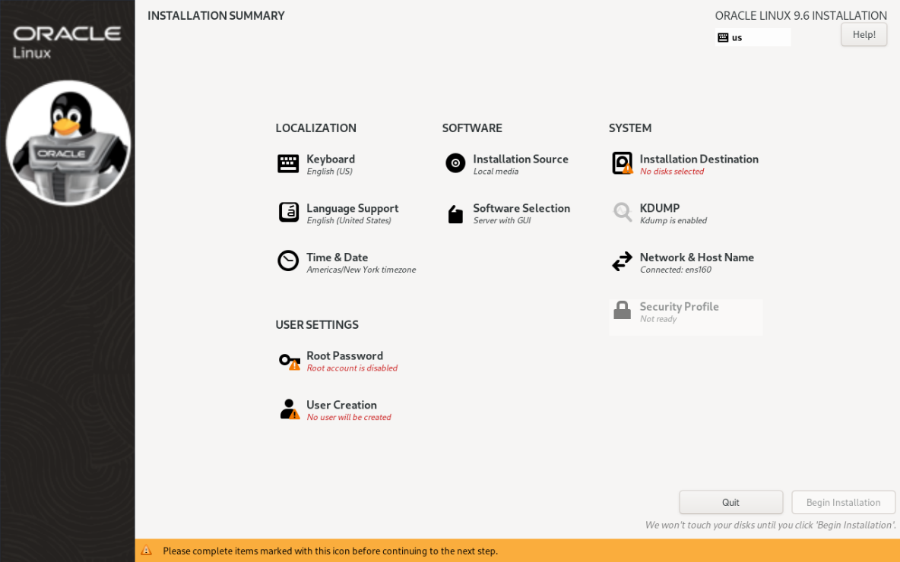

The screen is divided into four sections:

| Section | Configuration Items |
|---------|---------------------|
| **LOCALIZATION** | Keyboard, Language Support, Time & Date |
| **SOFTWARE** | Installation Source, Software Selection |
| **SYSTEM** | Installation Destination, KDUMP, Network & Host Name, Security Profile |
| **USER SETTINGS** | Root Password, User Creation |

> **Important:** Items marked in **red/orange** are mandatory and must be configured before clicking "Begin Installation". At minimum: **Root Password** and **Installation Destination** must be set.

Work through each configuration item as described in the following steps.

---

### Step 3: Time & Date

Click **"Time & Date"** under the LOCALIZATION section.

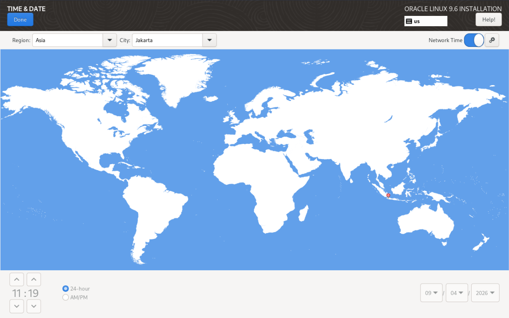

| Setting | Value |
|---------|-------|
| **Region** | Asia |
| **City** | Jakarta |
| **Timezone** | WIB — Western Indonesia Time (UTC+7) |
| **Network Time (NTP)** | ON |

- Click on the map near **Jakarta, Indonesia** or use the Region/City dropdowns
- Click **"Done"** to save

> **Note on NTP:** With Network Time enabled, the clock synchronizes automatically once the network interface is active, so the displayed time may still show the installer's default value until the connection comes up.

---

### Step 4: Root Password

Click **"Root Password"** under the USER SETTINGS section.

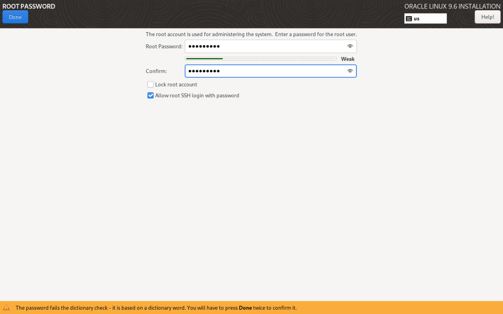

- Enter a password in the **"Root Password"** field
- Re-enter the same password in the **"Confirm"** field
- Leave **"Lock root account"** unchecked
- Check **"Allow root SSH login with password"** so the server can be reached remotely (via PuTTY) right after installation
- Click **"Done"** to save

> **Security Recommendation:** Use a password with at least 12 characters combining uppercase letters, lowercase letters, numbers, and special characters. The `root` account has unrestricted administrative access to the entire system — a weak password (as flagged by the strength indicator) should only be used for lab/testing VMs, never for production.

---

### Step 5: User Account Creation

For this installation, **no local user account was created at this stage** — the "User Creation" item was intentionally left unset in the Installation Summary.

> **Why skip it here?** Oracle Linux's `initial-setup` service detects that no non-root user exists yet and automatically prompts for account creation on first boot, right inside the GNOME Initial Setup wizard. This installation defers user creation to that step — see [Part 5 — Initial Setup Wizard (Account Creation)](#part-5--initial-setup-wizard-account-creation).

---

### Step 6: KDUMP Configuration

Click **"KDUMP"** under the SYSTEM section.

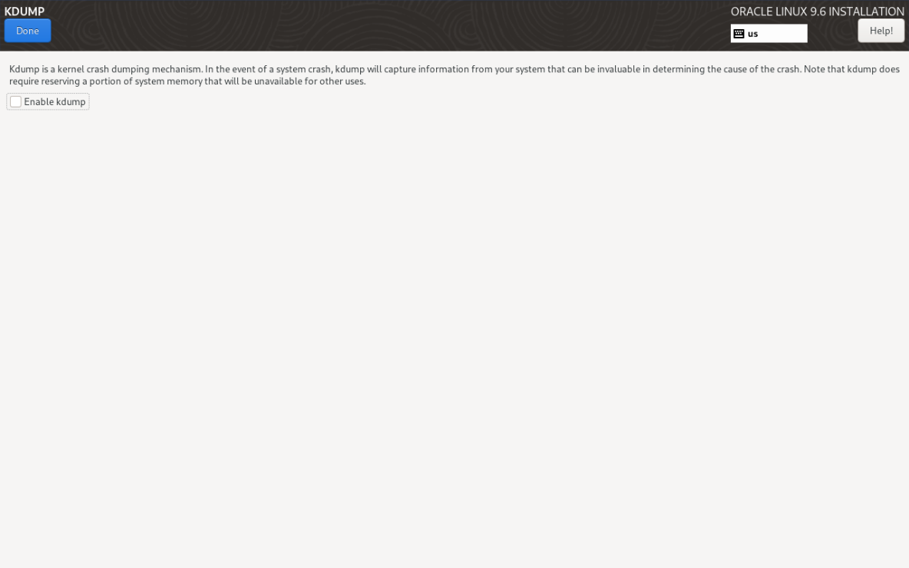

- **Uncheck** the **"Enable kdump"** checkbox to disable it
- Click **"Done"** to save

> **Why disable KDUMP?**
> KDUMP is a kernel crash dump mechanism that permanently reserves a portion of RAM at boot. Disabling it:
> - Frees reserved memory back to the OS
> - Avoids potential conflicts during Oracle Database installation
> - Prevents the Oracle installer from flagging memory as insufficient
>
> KDUMP can be re-enabled after Oracle Database is successfully installed if kernel crash analysis capability is required for production.

---

### Step 7: Network & Hostname

Click **"Network & Host Name"** under the SYSTEM section.

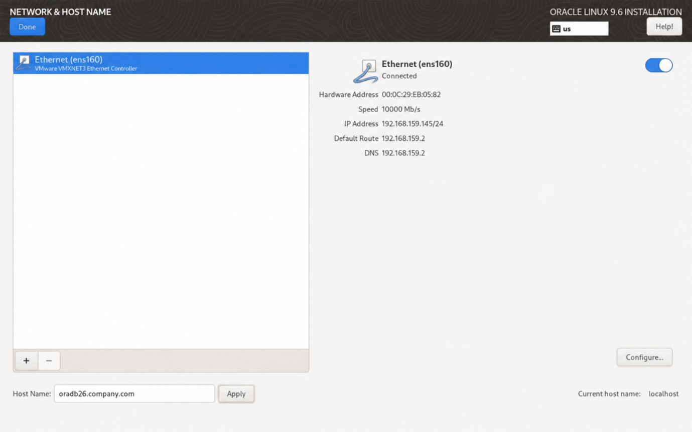

**Configuration steps:**

1. Select the **ens160** interface in the left panel (VMware VMXNET3 Ethernet Controller)
2. Toggle the switch to **"ON"** to enable the interface — it will obtain an IP via DHCP
3. In the **"Host Name"** field at the bottom, enter: `oradb26.company.com`
4. Click **"Apply"** to set the hostname
5. Click **"Done"** to save

**Resulting network details (after DHCP assignment):**

| Parameter | Value |
|-----------|-------|
| **Interface** | ens160 |
| **Status** | Connected |
| **Hardware Address (MAC)** | 00:0C:29:EB:05:82 |
| **Link Speed** | 10000 Mb/s |
| **IP Address** | 192.168.159.145 / 24 |
| **Default Route (Gateway)** | 192.168.159.2 |
| **DNS** | 192.168.159.2 |

> **Static IP Configuration:** For a production server with a fixed IP, click **"Configure..."** before enabling the interface. Navigate to the **IPv4 Settings** tab, change the method to **Manual**, and add the desired IP address, netmask, gateway, and DNS values.

---

### Step 8: Security Policy

Click **"Security Profile"** under the SYSTEM section.

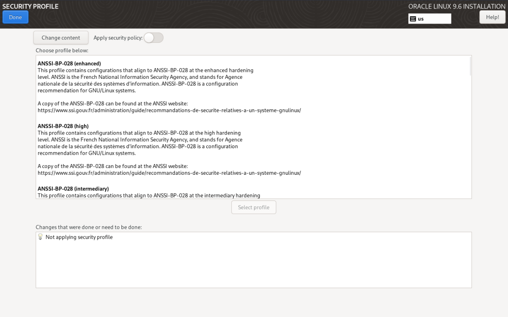

- Leave the **"Apply security policy"** toggle set to **"OFF"**
- The status will show **"Not applying security profile"**
- Click **"Done"** to save

> **Why disable Security Policy?**
> Available security profiles (e.g., ANSSI-BP-028 enhanced/high/intermediary) apply mandatory OS hardening such as strict file permissions, restricted system calls, and tightened network rules. These restrictions are incompatible with Oracle Database installation requirements, which need:
> - Specific kernel parameters to be set freely
> - Access to `/tmp` and `/dev/shm` without restriction
> - Installation scripts with elevated privileges
>
> It is recommended to assess and re-apply an appropriate security profile **after** Oracle Database is installed and tested.

---

### Step 9: Software Selection

Click **"Software Selection"** under the SOFTWARE section.

#### Base Environment

Select **"Server with GUI"** as the Base Environment.

| Base Environment Option | Description |
|-------------------------|-------------|
| **Server with GUI** *(selected)* | Full server with GNOME desktop — enables Oracle graphical installer |
| Server | Integrated, easy-to-manage server without desktop |
| Minimal Install | Basic functionality only — requires silent Oracle installation |
| Workstation | User-friendly desktop for laptops/PCs |
| Custom Operating System | Basic building block for a custom OL system |
| Virtualization Host | Minimal virtualization host |

> **Why Server with GUI?** The Oracle Database Universal Installer (OUI) is a graphical application. Selecting "Server with GUI" provides the GNOME desktop environment required to run OUI interactively. If you prefer a silent (non-GUI) installation, "Minimal Install" is sufficient.

#### Additional Software Groups

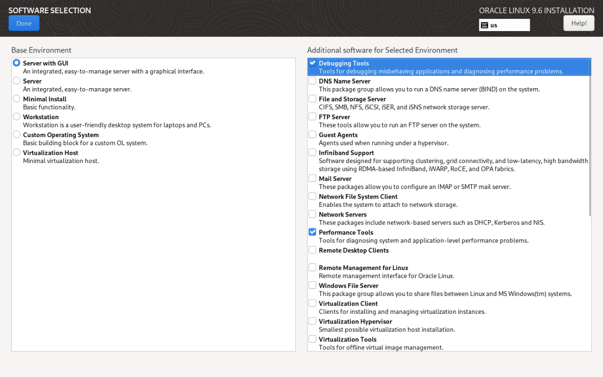

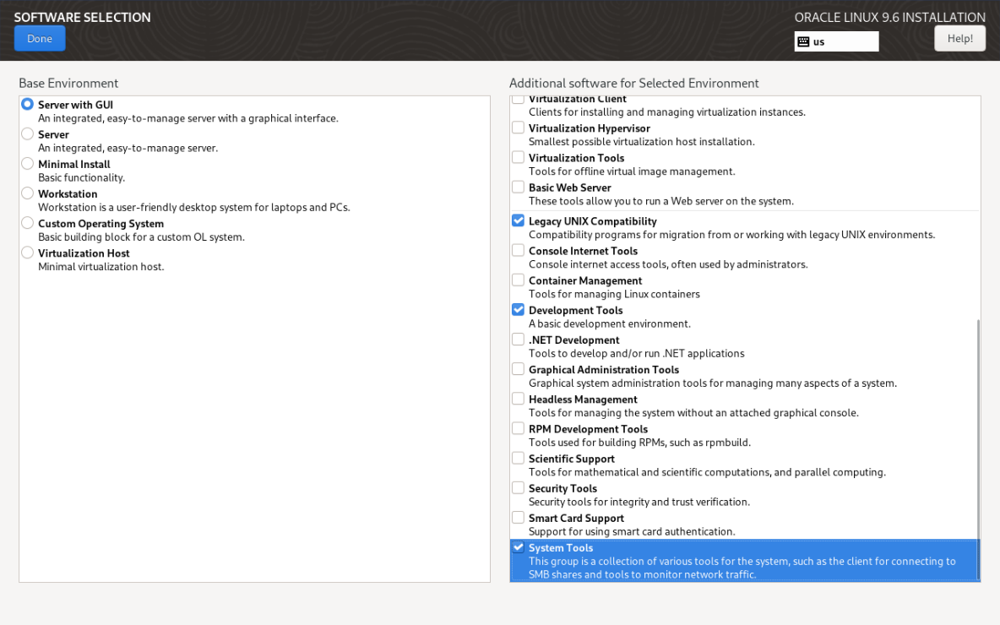

Check the following additional package groups:

| Package Group | Why It Is Needed |
|---------------|-----------------|
| **Debugging Tools** | Tools for diagnosing misbehaving applications and performance problems |
| **Performance Tools** | System and application-level performance diagnostics |
| **Legacy UNIX Compatibility** | Compatibility programs for UNIX migration environments — required by some Oracle scripts |
| **Development Tools** | GCC compiler, `make`, development headers — required by Oracle installer for linking |
| **System Tools** | System utilities including SMB client and network monitoring tools |

Click **"Done"** to save.

---

### Step 10: Installation Destination (Disk Partitioning)

Click **"Installation Destination"** under the SYSTEM section.

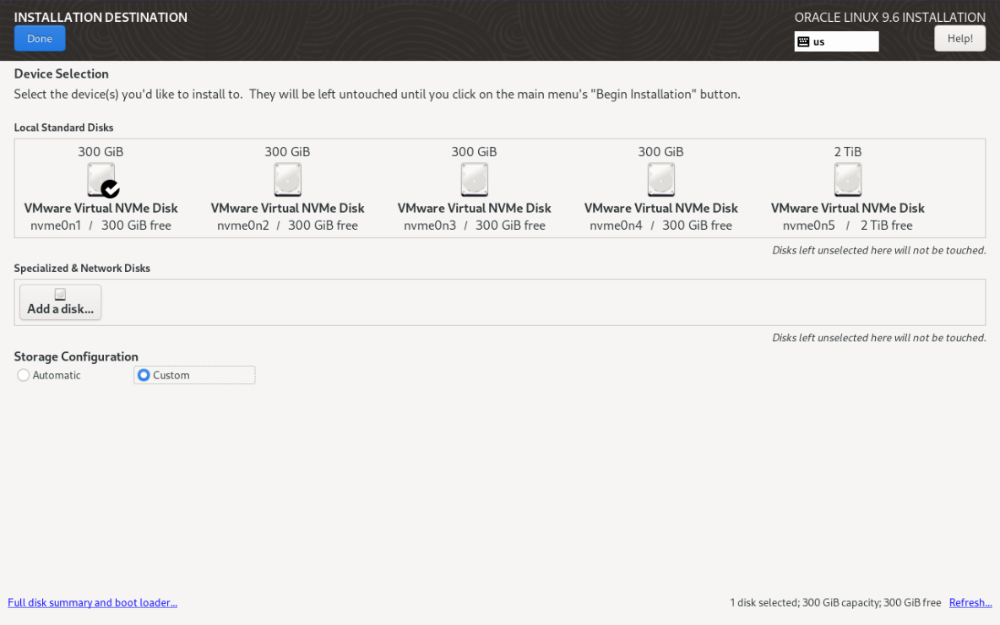

Five virtual disks are presented (four 300 GiB disks and one 2 TiB disk). Select only the **first 300 GiB disk (`nvme0n1`)** for the OS installation — the other four are left unselected/untouched for later Oracle Database storage use. Choose **"Custom"** storage configuration, then click **"Done"**.

#### Partition Layout

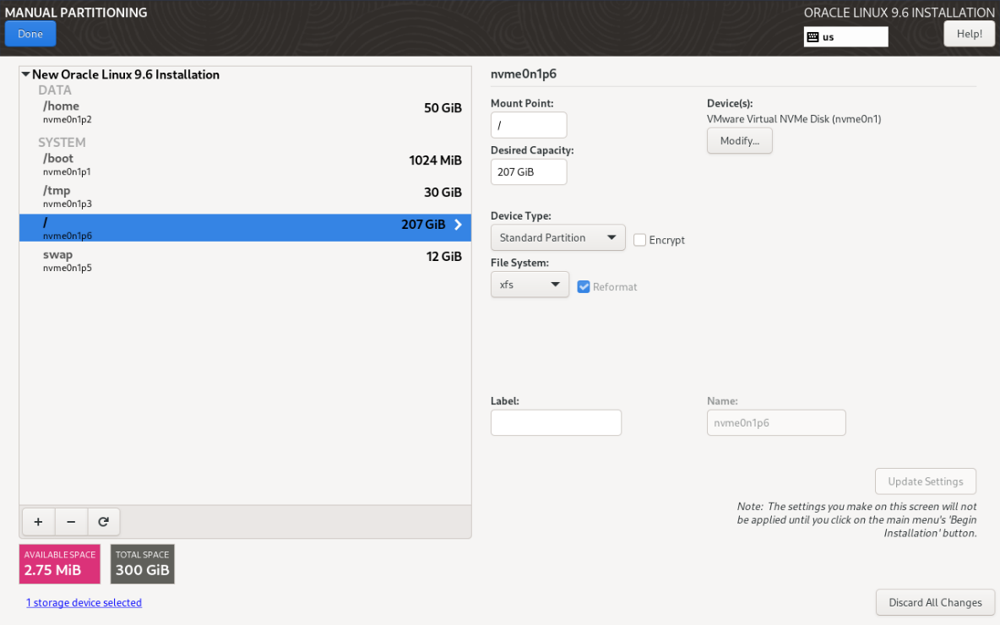

| Mount Point | Size | Device | File System | Purpose |
|-------------|------|--------|-------------|---------|
| `/boot` | 1024 MiB | nvme0n1p1 | xfs | Boot files and kernel images |
| `/home` | 50 GiB | nvme0n1p2 | xfs | User home directories |
| `/tmp` | 30 GiB | nvme0n1p3 | xfs | Temporary files (Oracle installer uses heavily) |
| `swap` | 12 GiB | nvme0n1p5 | swap | Virtual memory (2× physical RAM) |
| `/` | 207 GiB | nvme0n1p6 | xfs | Root filesystem — Oracle software installed here |
| **Total** | **~300 GiB** | | | |

#### Partition Sizing Rationale

| Partition | Reason for Size |
|-----------|----------------|
| `/boot` (1 GiB) | Sufficient for multiple kernel versions and initramfs images |
| `/home` (50 GiB) | Space for user files and Oracle user home (`/home/oracle`) |
| `/tmp` (30 GiB) | Oracle installer extracts large staging files to `/tmp` — at least 10 GB required |
| `swap` (12 GiB) | Oracle recommends 1×–2× physical RAM; with 6 GB RAM, 12 GB swap is used |
| `/` (207 GiB) | Contains Oracle Base (`/u01/app/oracle`) and Oracle Home — large installation footprint |

> **File System Choice (XFS):** XFS is the default and recommended filesystem for RHEL/Oracle Linux 9.x. It provides high performance for large files, supports online resizing, and is well-suited for database workloads.

Click **"Done"** when partitioning is complete.

---

#### Summary of Changes Confirmation

A dialog box will appear listing all disk operations to be performed before changes are written.

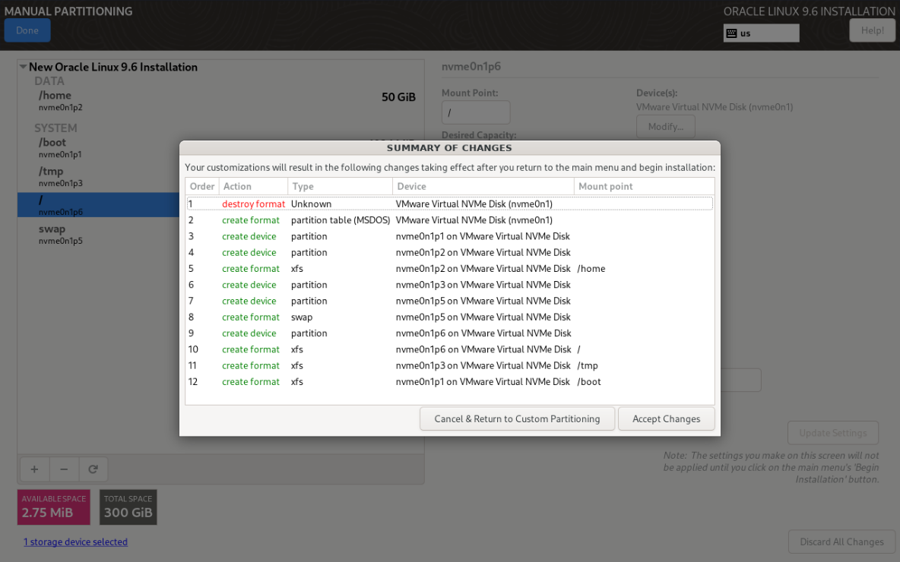

The operations include:
- `destroy format` — removes any existing partition table on the disk
- `create format` — creates a new MBR/GPT partition table (MSDOS format)
- `create device` — creates each physical partition
- `create format` — formats each partition with the specified filesystem (xfs or swap)

Review the list carefully, then click **"Accept Changes"** to confirm.

---

### Step 11: Final Installation Summary & Begin Installation

After all settings have been configured, the Installation Summary will show all items without warning icons.

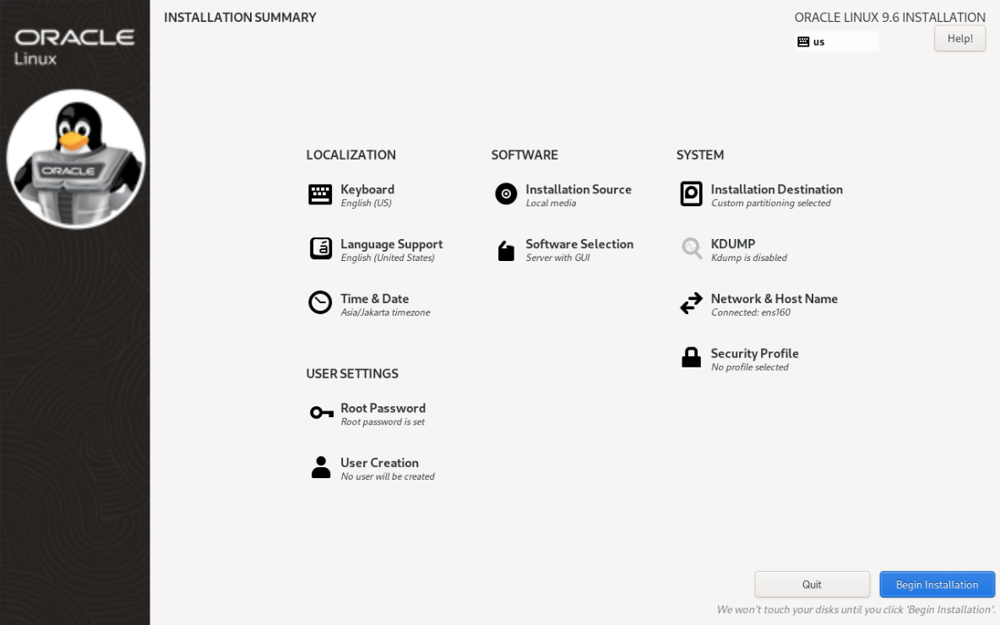

**Pre-installation checklist:**

| Configuration Item | Status | Value |
|--------------------|--------|-------|
| Time & Date | ✅ Configured | Asia/Jakarta timezone |
| Software Selection | ✅ Configured | Server with GUI |
| Installation Destination | ✅ Configured | Custom partitioning selected |
| KDUMP | ✅ Configured | Kdump is disabled |
| Network & Host Name | ✅ Configured | Connected: ens160 |
| Security Profile | ✅ Configured | No profile selected (OFF) |
| Root Password | ✅ Configured | Root password is set |
| User Creation | ⚪ Skipped | No user will be created (deferred to Initial Setup) |

All required items confirmed. Click **"Begin Installation"** to start the installation process.

---

## Part 3 — Installation Process

The installation will begin automatically. The progress screen shows real-time status.

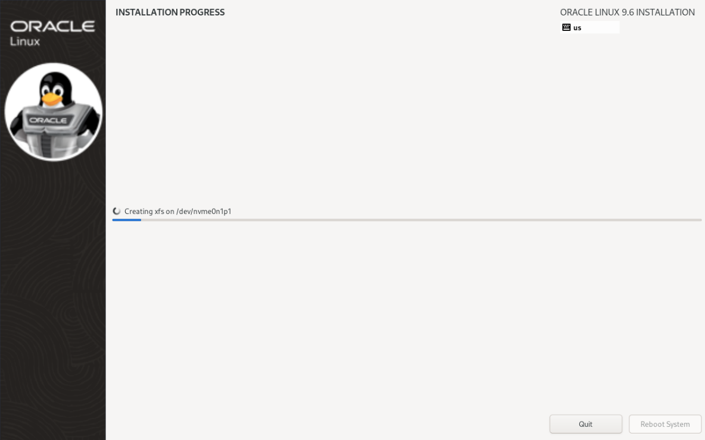

The installer performs the following operations sequentially:

1. Creates a disk label on `/dev/nvme0n1`
2. Creates and formats all partitions (xfs, swap)
3. Installs the base OS packages
4. Installs selected software groups (Server with GUI, Development Tools, etc.)
5. Configures the bootloader (GRUB2) on `/boot`
6. Runs post-installation scripts and SELinux labeling
7. Finalizes system configuration

> **Duration:** The installation typically takes **15–30 minutes** depending on VM performance and disk I/O speed.

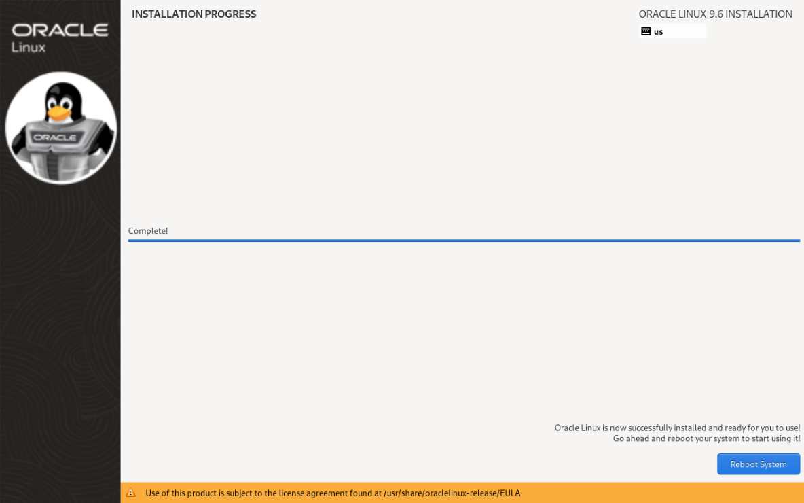

When installation finishes:
- The progress bar shows **"Complete!"**
- Message: *"Oracle Linux is now successfully installed and ready for you to use! Go ahead and reboot your system to start using it!"*
- A note at the bottom references the EULA at `/usr/share/oraclelinux-release/EULA`

Click **"Reboot System"** to restart the VM.

> **Important:** Remove the ISO image from the VM's CD/DVD drive before or after rebooting to prevent booting back into the installer.

---

## Part 4 — Initial Setup After Reboot

### Step 12: GRUB Boot Menu

After reboot, the **GRUB2** bootloader menu appears (in the same style as the installer boot menu shown in [Part 1](#part-1--boot-from-installation-media)), listing the newly installed **Oracle Linux Server 9.6** kernel entry and a rescue kernel entry.

Select the **normal boot entry** and press **Enter**, or wait for the automatic countdown.

---

### Step 13: Initial Setup Wizard Launch

Because no local user account was created during installation (see [Step 5](#step-5-user-account-creation)), the system does **not** present a traditional GDM login screen on first boot. Instead, the `initial-setup` service starts automatically and opens the GNOME **Initial Setup** wizard directly on the console:

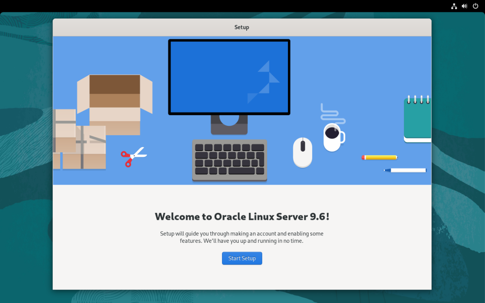

Click **"Start Setup"** to continue.

---

## Part 5 — Initial Setup Wizard (Account Creation)

### Privacy Settings

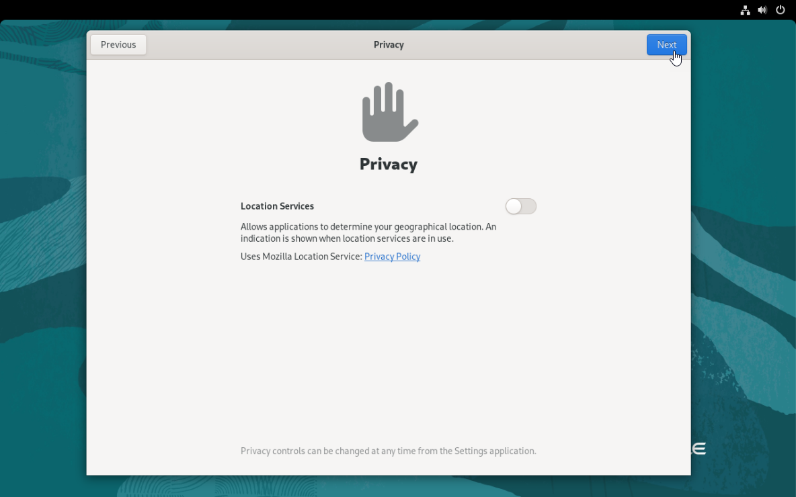

| Setting | Value | Reason |
|---------|-------|--------|
| **Location Services** | OFF | Not required for a database server |

- Leave the toggle **OFF**
- Click **"Next"**

---

### Online Accounts

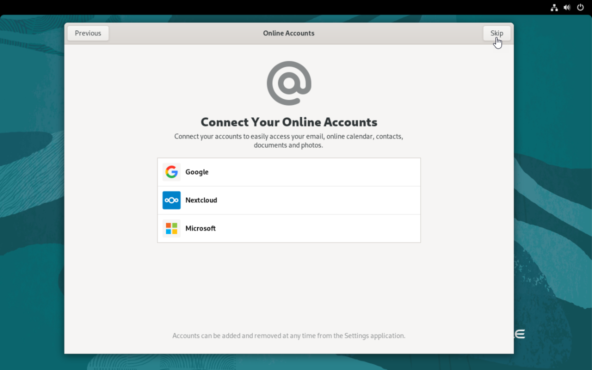

Available account integrations: Google, Nextcloud, Microsoft.

- Click **"Skip"** — online account integration is not needed for a database server

---

### About You — Create the Local User

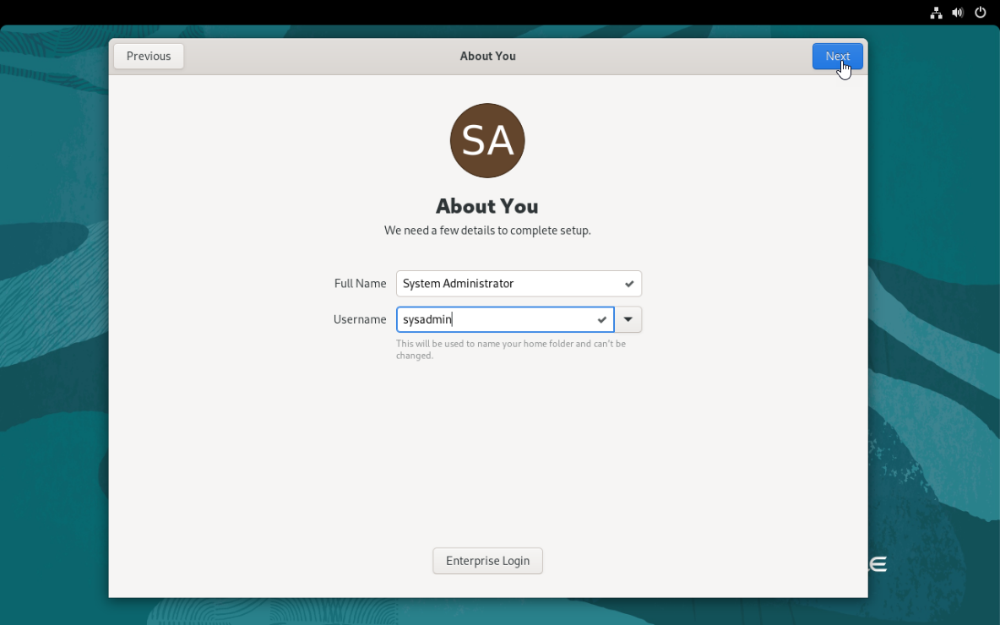

| Field | Value |
|-------|-------|
| **Full name** | System Administrator |
| **Username** | sysadmin |

- Click **"Next"**

> **Best Practice:** Always create at least one non-root user. The `root` account should be used only when administrative privilege is explicitly required. Regular operations (including Oracle DB management) use dedicated service accounts.

---

### Set a Password

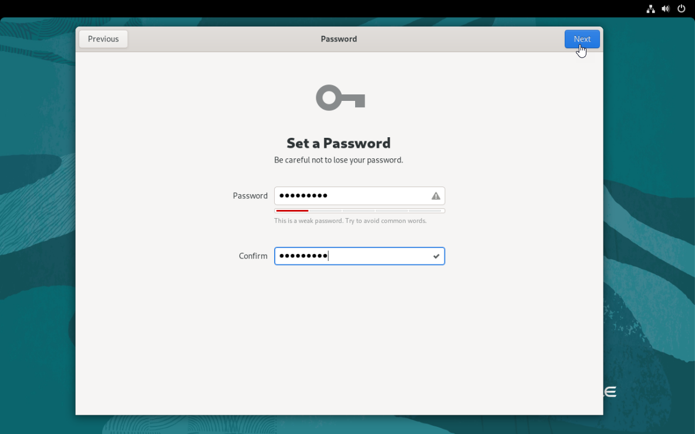

- Enter a password in the **"Password"** field and repeat it in **"Confirm"**
- Click **"Next"**

> **Security Recommendation:** The strength indicator will flag a common/weak password (as shown here for a lab VM). For production systems, use at least 12 characters combining uppercase, lowercase, numbers, and special characters.

---

## Part 6 — Setup Complete & First Desktop

### All Done

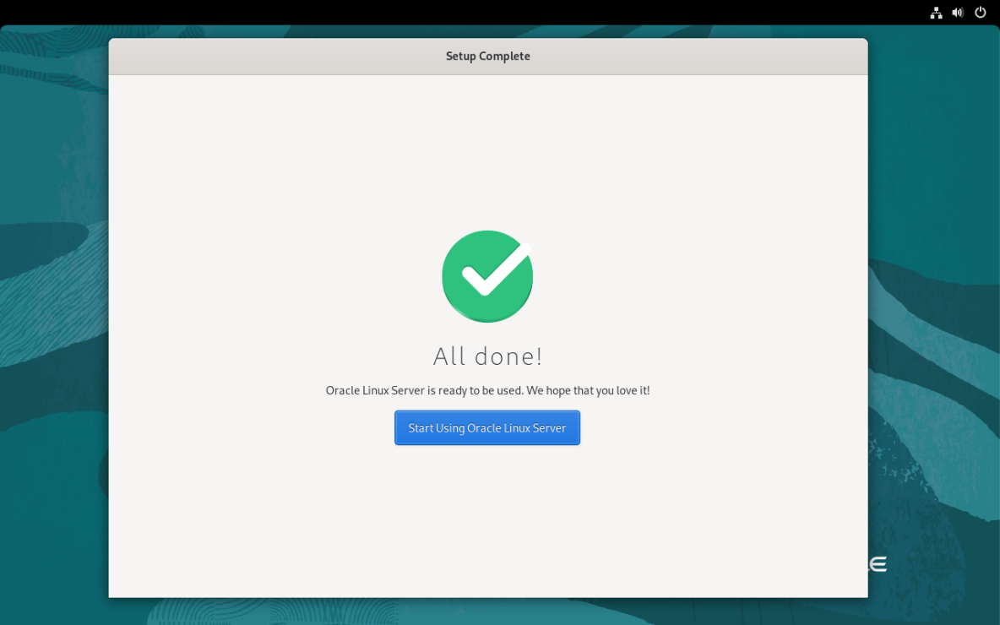

The wizard is complete. Click **"Start Using Oracle Linux Server"**.

---

### Welcome Tour Prompt

Once the GNOME desktop loads for the first time, a welcome popup appears offering a guided tour.

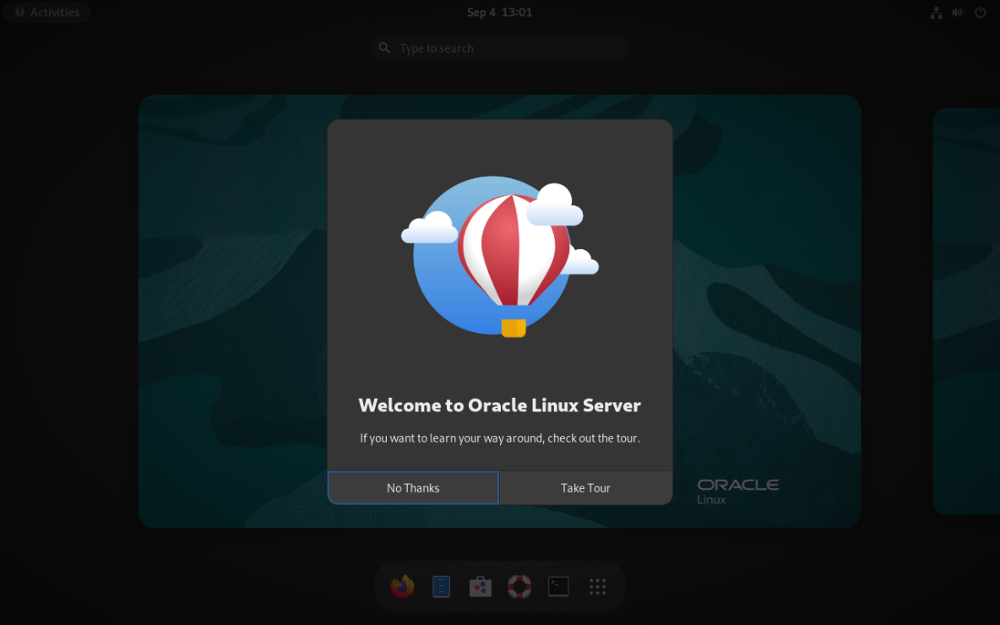

- Click **"No Thanks"** to dismiss it and go straight to the desktop

---

### GNOME Desktop

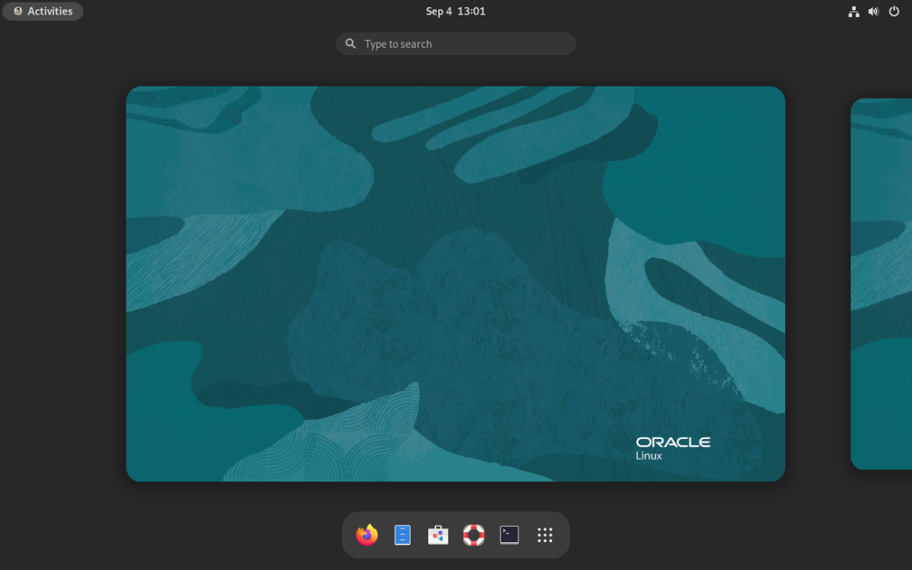

The GNOME desktop, logged in as the `sysadmin` user created during Initial Setup, is now ready.

> **Note:** For day-to-day administration, use `sudo` or `su -` from this regular user account to perform elevated tasks such as configuring the Oracle Database prerequisites.

---

## Part 7 — Post-Installation CLI Configuration

Open a **Terminal** from the GNOME desktop (Activities → Terminal), or connect remotely via **PuTTY** from a client machine using SSH.

```
SSH connection: login as root or sysadmin to 192.168.159.145
```

---

### 7.1 Verify Network Interface

Check the active network configuration:

```bash
$ ifconfig
ens160: flags=4163<UP,BROADCAST,RUNNING,MULTICAST>  mtu 1500
        inet 192.168.159.145  netmask 255.255.255.0  broadcast 192.168.159.255
        inet6 fe80::20c:29ff:feeb:582  prefixlen 64  scopeid 0x20<link>
        ether 00:0c:29:eb:05:82  txqueuelen 1000  (Ethernet)
        RX packets 225237  bytes 338548573 (322.8 MiB)
        RX errors 0  dropped 0  overruns 0  frame 0
        TX packets 93554  bytes 5070372 (4.8 MiB)
        TX errors 0  dropped 0 overruns 0  carrier 0  collisions 0

lo: flags=73<UP,LOOPBACK,RUNNING>  mtu 65536
        inet 127.0.0.1  netmask 255.0.0.0
        inet6 ::1  prefixlen 128  scopeid 0x10<host>
        loop  txqueuelen 1000  (Local Loopback)
```

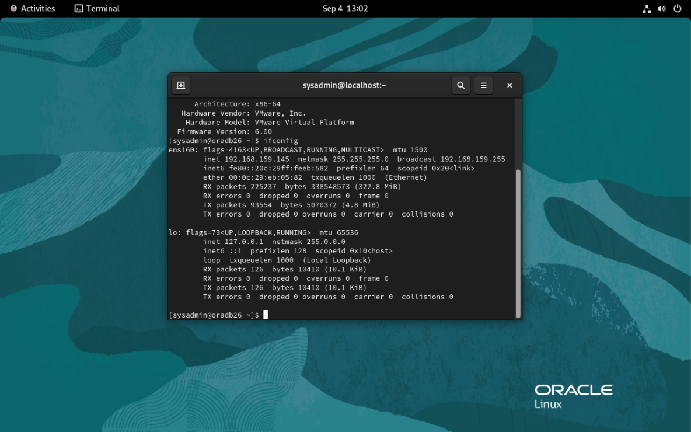

The output confirms `ens160` is UP with IP address `192.168.159.145/24`.

---

### 7.2 Verify System Date and Time

```bash
$ date
Fri Sep  4 01:04:02 PM WIB 2026
```

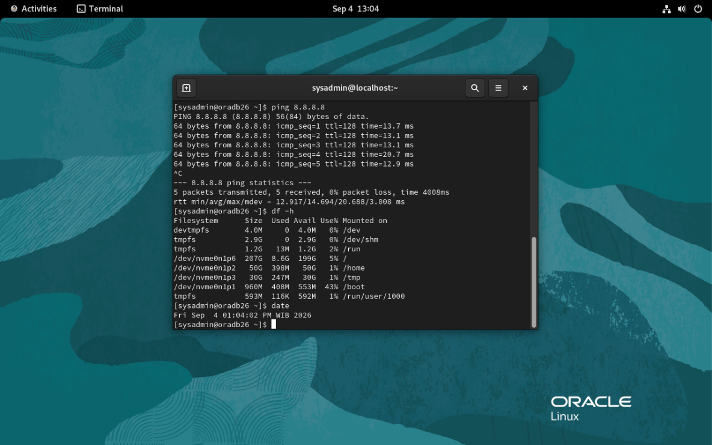

Confirm the timezone is correctly set to WIB (UTC+7).

---

### 7.3 View and Update `/etc/hosts`

View the current hosts file:

```bash
$ cat /etc/hosts
127.0.0.1   localhost localhost.localdomain localhost4 localhost4.localdomain4
::1         localhost localhost.localdomain localhost6 localhost6.localdomain6
```

Open the file for editing:

```bash
$ sudo vi /etc/hosts
```

> **Vi quick reference:** Press `i` to enter insert mode, make changes, then press `Esc`, type `:wq`, and press `Enter` to save and exit.

Update the file content as follows:

```
127.0.0.1   localhost localhost.localdomain localhost4 localhost4.localdomain4
192.168.159.145 oradb26.company.com oradb26
```

Verify the saved changes:

```bash
$ cat /etc/hosts
127.0.0.1   localhost localhost.localdomain localhost4 localhost4.localdomain4
192.168.159.145 oradb26.company.com oradb26
```

> **Why update `/etc/hosts`?** Oracle Database requires the server's FQDN and short hostname to resolve correctly without depending solely on DNS. The `/etc/hosts` entry ensures the Oracle listener and database can resolve the hostname locally even if DNS is unavailable.

---

### 7.4 Verify Hostname

```bash
$ cat /etc/hostname
oradb26.company.com
```

The hostname was set during installation in the Network & Host Name step and persisted to `/etc/hostname`.

---

### 7.5 Test Internet Connectivity

```bash
$ ping 8.8.8.8
PING 8.8.8.8 (8.8.8.8) 56(84) bytes of data.
64 bytes from 8.8.8.8: icmp_seq=1 ttl=128 time=13.7 ms
64 bytes from 8.8.8.8: icmp_seq=2 ttl=128 time=13.1 ms
64 bytes from 8.8.8.8: icmp_seq=3 ttl=128 time=13.1 ms
64 bytes from 8.8.8.8: icmp_seq=4 ttl=128 time=20.7 ms
64 bytes from 8.8.8.8: icmp_seq=5 ttl=128 time=12.9 ms
^C
--- 8.8.8.8 ping statistics ---
5 packets transmitted, 5 received, 0% packet loss, time 4008ms
rtt min/avg/max/mdev = 12.917/14.694/20.688/3.008 ms
```

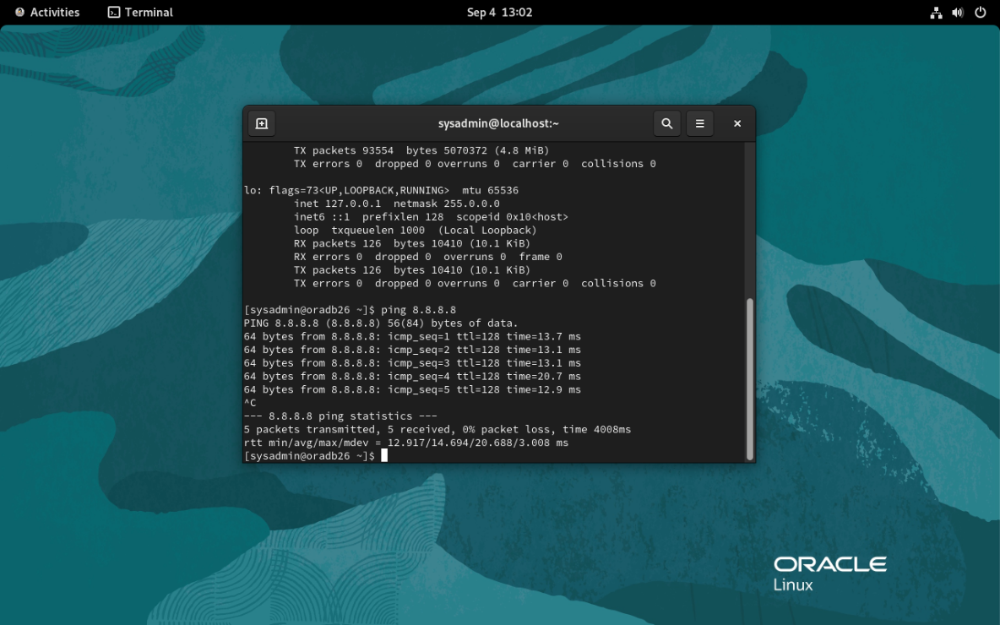

- **0% packet loss** confirms the network is operational
- Internet access is available for downloading Oracle packages and updates

---

### 7.6 Verify System Information

```bash
$ hostnamectl
   Static hostname: oradb26.company.com
         Icon name: computer-vm
           Chassis: vm
        Machine ID: 46f2fa5966574b80aad2f420f198fabc
           Boot ID: 967c7bc939c64f7cbb70e953f55b966e
    Virtualization: vmware
  Operating System: Oracle Linux Server 9.6
       CPE OS Name: cpe:/o:oracle:linux:9:6:server
            Kernel: Linux 6.12.0-1.23.3.2.el9uek.x86_64
      Architecture: x86-64
   Hardware Vendor: VMware, Inc.
    Hardware Model: VMware Virtual Platform
   Firmware Version: 6.00
```

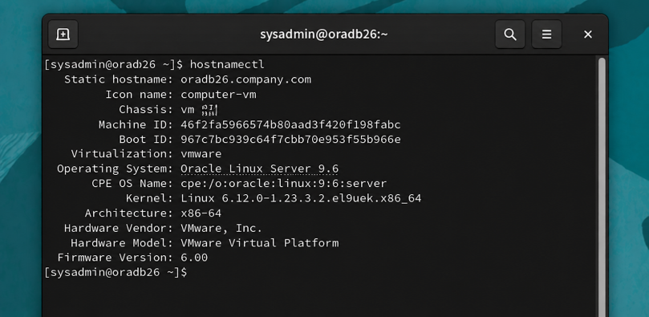

**Output verification checklist:**

| Field | Expected Value | Status |
|-------|---------------|--------|
| Static hostname | oradb26.company.com | ✅ |
| Virtualization | vmware | ✅ |
| Operating System | Oracle Linux Server 9.6 | ✅ |
| Kernel | Linux 6.12.0-1.23.3.2.el9uek.x86_64 | ✅ |
| Architecture | x86-64 | ✅ |

---

### 7.7 Verify Disk & Partition Usage

```bash
$ df -h
Filesystem      Size  Used Avail Use% Mounted on
devtmpfs        4.0M     0  4.0M   0% /dev
tmpfs           2.9G     0  2.9G   0% /dev/shm
tmpfs           1.2G   13M  1.2G   2% /run
/dev/nvme0n1p6  207G  8.6G  199G   5% /
/dev/nvme0n1p2   50G  398M   50G   1% /home
/dev/nvme0n1p3   30G  247M   30G   1% /tmp
/dev/nvme0n1p1  960M  408M  553M  43% /boot
tmpfs           593M  116K  592M   1% /run/user/1000
```

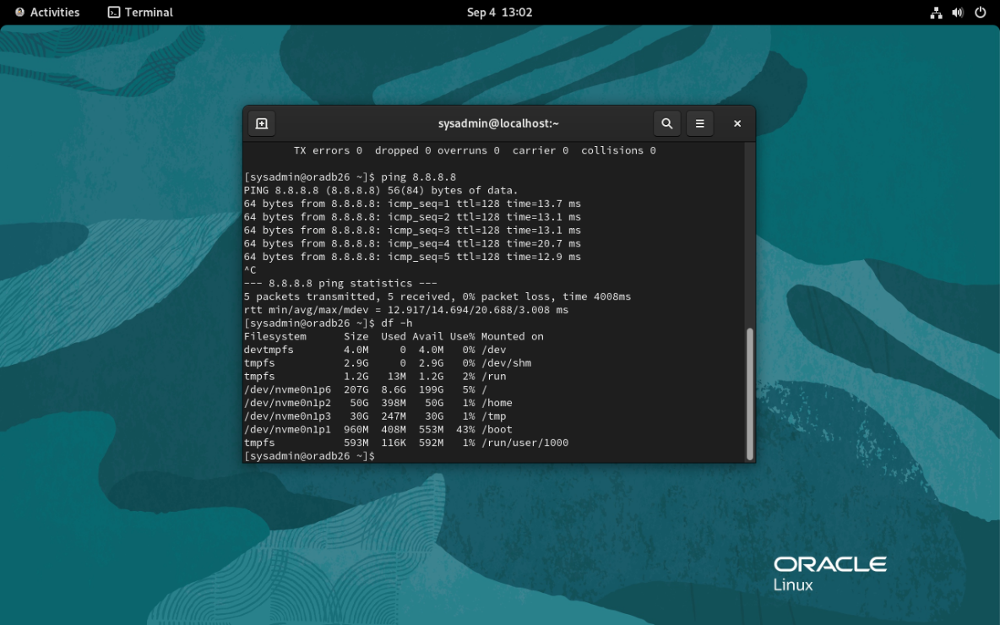

The mounted filesystems match the partition layout defined in [Step 10](#step-10-installation-destination-disk-partitioning), confirming the disk was partitioned and formatted as planned.

---

## Summary of Key Configurations

| Category | Setting | Configured Value |
|----------|---------|-----------------|
| **OS** | Version | Oracle Linux Server 9.6 |
| **OS** | Kernel | Linux 6.12.0-1.23.3.2.el9uek.x86_64 |
| **OS** | Architecture | x86-64 |
| **Timezone** | Region / City | Asia / Jakarta (WIB, UTC+7) |
| **Network** | Interface | ens160 (VMware VMXNET3) |
| **Network** | IP Address | 192.168.159.145 / 24 |
| **Network** | Default Gateway | 192.168.159.2 |
| **Network** | DNS Server | 192.168.159.2 |
| **Hostname** | FQDN | oradb26.company.com |
| **Hostname** | Short Name | oradb26 |
| **Users** | Root Account | Enabled (password set, SSH login allowed) |
| **Users** | Regular User | sysadmin (Full name: System Administrator, created via Initial Setup) |
| **Software** | Base Environment | Server with GUI |
| **Software** | Additional Groups | Debugging Tools, Performance Tools, Legacy UNIX Compatibility, Development Tools, System Tools |
| **KDUMP** | Status | **Disabled** |
| **Security Profile** | Status | **OFF** (No profile selected) |
| **Filesystem Type** | All partitions | XFS |
| **Disk** | `/boot` | 1024 MiB (nvme0n1p1) |
| **Disk** | `/home` | 50 GiB (nvme0n1p2) |
| **Disk** | `/tmp` | 30 GiB (nvme0n1p3) |
| **Disk** | `swap` | 12 GiB (nvme0n1p5) — 2× RAM |
| **Disk** | `/` (root) | 207 GiB (nvme0n1p6) |
| **Disk** | **Total (OS disk)** | **~300 GiB** |
| **Disk** | Additional disks (unused) | 3× 300 GiB + 1× 2 TiB — reserved for Oracle Database storage |

---

## Next Steps

The Oracle Linux 9.6 OS installation is now complete. The system is ready for the Oracle Database 26 installation process.

| Stage | Document | Description |
|-------|----------|-------------|
| **1** | [Oracle Database 26 Installation on Oracle Linux 9](https://oracle-base.com/articles/26/oracle-db-26-installation-on-oracle-linux-9) | Configure kernel parameters, install required OS packages, create Oracle user/groups, run the Oracle Universal Installer (OUI), and create the database instance |

See the [References](#references) section below for official documentation links.

---

## References

### 1. Oracle Linux Official Documentation

| Document | URL |
|----------|-----|
| **Oracle Linux Main Site** | https://linux.oracle.com |
| **Oracle Linux Documentation** | https://docs.oracle.com/en/operating-systems/oracle-linux/9/ |
| **Oracle Linux ISO Downloads** | https://yum.oracle.com/oracle-linux-isos.html |
| **Oracle Linux GitHub** | https://github.com/oracle/oracle-linux |
| **Oracle Linux Blog** | https://blogs.oracle.com/linux/ |
| **Oracle Linux Support (My Oracle Support)** | https://support.oracle.com |

---

### 2. Oracle Database 26 — Related Documentation

| Document | URL |
|----------|-----|
| **Oracle DB 26 Installation on Oracle Linux 9 (oracle-base.com)** | https://oracle-base.com/articles/26/oracle-db-26-installation-on-oracle-linux-9 |
| **Oracle Database Documentation Library** | https://docs.oracle.com/en/database/oracle/oracle-database/ |
| **Oracle Database Download (requires Oracle account)** | https://www.oracle.com/database/technologies/oracle-database-software-downloads.html |
| **Oracle Support Matrix** | https://support.oracle.com/knowledge/Oracle%20Database%20Products/742060.1.html |

---

### 3. Supporting Tools

| Tool | Purpose | Download URL |
|------|---------|--------------|
| **PuTTY** | SSH client for remote connection to the Linux server | https://www.putty.org/ |
| **WinSCP** | SFTP/SCP file transfer client (Windows → Linux) | https://winscp.net/ |
| **MobaXterm** | All-in-one terminal (SSH, SFTP, X11 forwarding) | https://mobaxterm.mobatek.net/ |
| **7-Zip** | File archiver — useful for extracting Oracle zip files | https://www.7-zip.org/ |

---

### 4. GPG Key & Security Verification for Oracle Linux

Oracle Linux packages and ISOs are signed with GPG keys. To verify package authenticity:

| Key | Details |
|-----|---------|
| **Oracle Linux GPG Key** | Available at `/etc/pki/rpm-gpg/` on any Oracle Linux system |
| **Key Import URL** | https://yum.oracle.com/RPM-GPG-KEY-oracle-ol9 |

```bash
# Import the Oracle Linux GPG key on a Linux system
rpm --import https://yum.oracle.com/RPM-GPG-KEY-oracle-ol9

# Verify a downloaded RPM package signature
rpm -K <package.rpm>
```

---
